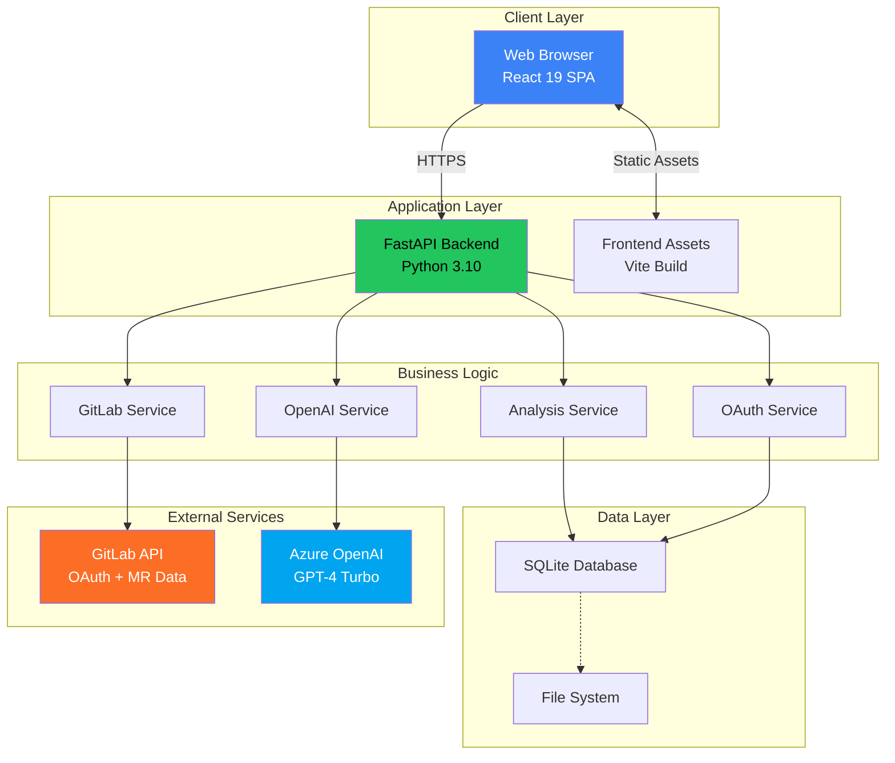
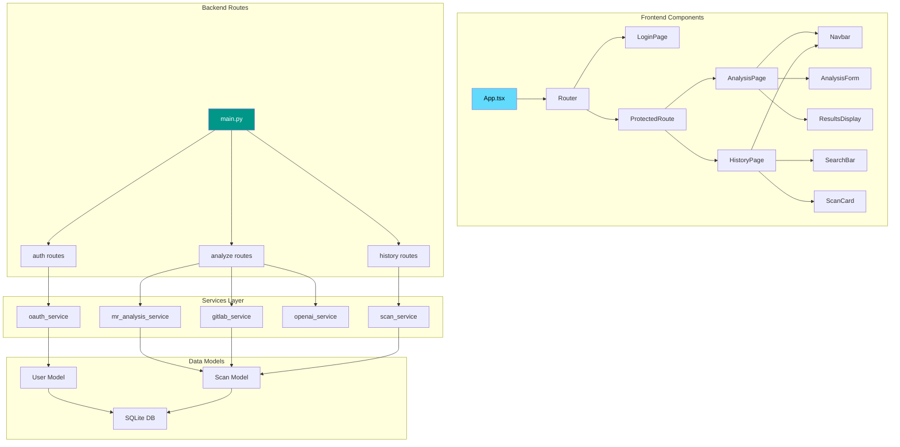
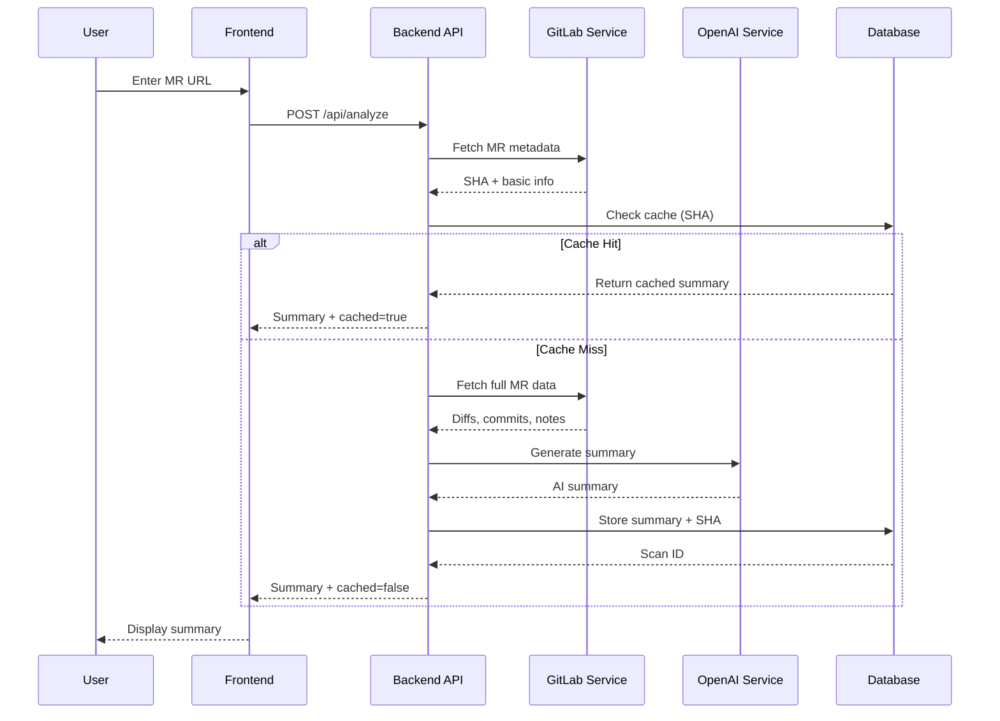
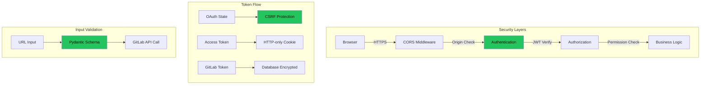
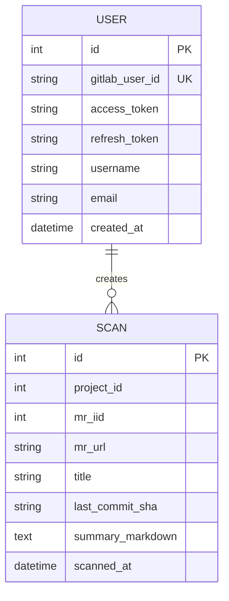
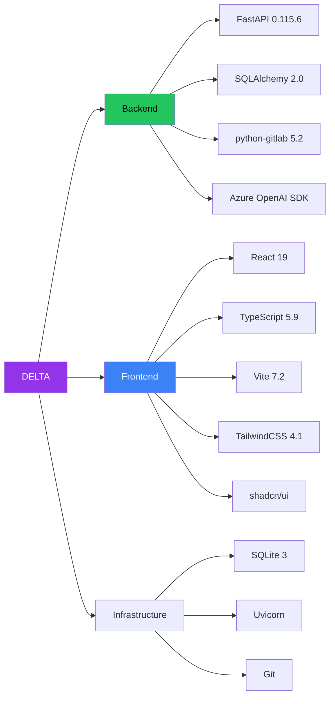

# System Architecture Documentation

**Project:** DELTA - Diff Explanation & Linguistic Transformation Assistant
**Document Type:** Systemarchitektur
**Version:** 2.0
**Last Updated:** 2025-12-11

## Executive Summary

This document presents the complete system architecture for DELTA with comprehensive diagrams covering all layers from infrastructure to components.

---

## High-Level Architecture

---

## Component Architecture

---

## Data Flow Architecture

### Analysis Flow

---

## Security Architecture

---

## Database Schema

---

## Technology Stack

---

**End of Architecture Documentation**
