# Design Documentation (G03)

**Project:** DELTA - Diff Explanation & Linguistic Transformation Assistant
**Document Type:** Gestaltungsentwürfe (Design Concepts)
**Version:** 2.0
**Last Updated:** 2025-12-11

## Executive Summary

This document presents the complete design evolution of DELTA, from initial sketches to final implementation. It demonstrates compliance with **G03: Entwicklung von Gestaltungsentwürfen** through comprehensive UI/UX design, system architecture diagrams, and design iteration documentation.

---

## Table of Contents

1. [Design Philosophy](#design-philosophy)
2. [Visual Design System](#visual-design-system)
3. [User Interface Designs](#user-interface-designs)
4. [Component Architecture](#component-architecture)
5. [Interaction Design](#interaction-design)
6. [Responsive Design](#responsive-design)
7. [Design Iterations](#design-iterations)
8. [Accessibility Considerations](#accessibility-considerations)

---

## Design Philosophy

### Core Principles

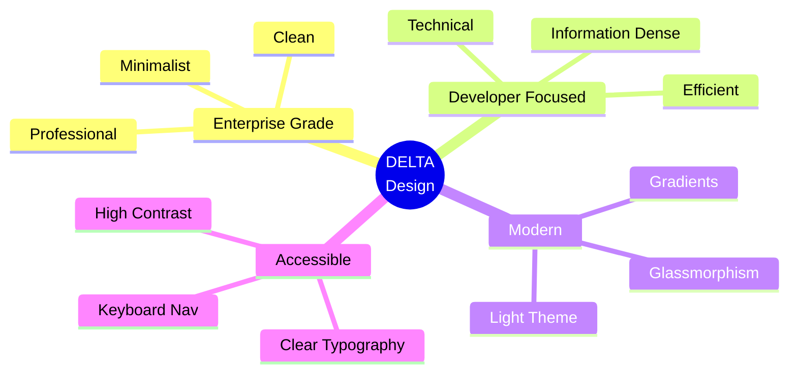

### Design Goals

| Goal | Description | Success Metric |
|------|-------------|----------------|
| **Clarity** | Information hierarchy is obvious | Users find MR summary in <2s |
| **Efficiency** | Minimize clicks to complete tasks | 3 clicks max from login to analysis |
| **Trust** | Professional appearance | User confidence rating >4.5/5 |
| **Speed** | Perceived performance | Loading states <100ms to appear |

---

## Visual Design System

### Color Palette

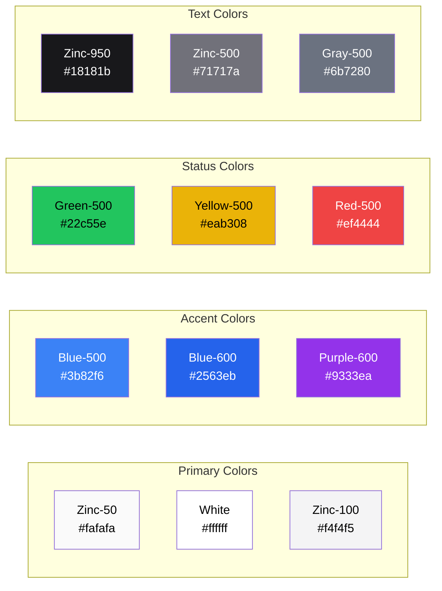

#### Color Application

| Element | Color | Rationale |
|---------|-------|-----------|
| Background | zinc-50 | Clean, bright background for professional appearance |
| Cards | white | Clear surface separation with subtle shadows |
| Borders | zinc-200 | Soft borders that define without overwhelming |
| Primary Action | blue-600 | Trust, professionalism (enterprise standard) |
| Accent | purple-600 | Modern, tech-forward |
| Success | green-500 | Universal success indicator |
| Warning | yellow-500 | Attention without alarm |
| Error | red-500 | Clear danger signal |
| Primary Text | zinc-950 | Maximum readability |
| Secondary Text | zinc-500 | Clear hierarchy |

### Typography

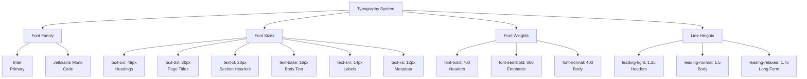

#### Typography Scale

| Element | Font | Size | Weight | Usage |
|---------|------|------|--------|-------|
| App Title | Inter | 48px (5xl) | 700 | DELTA branding |
| Page Title | Inter | 30px (3xl) | 700 | Login, Analysis, History |
| Section Header | Inter | 20px (xl) | 600 | MR Title, Summary Sections |
| Body Text | Inter | 16px (base) | 400 | Descriptions, summaries |
| Button Text | Inter | 16px (base) | 600 | CTAs |
| Label | Inter | 14px (sm) | 500 | Form labels |
| Metadata | Inter | 12px (xs) | 400 | Timestamps, authors |
| Code | JetBrains Mono | 14px (sm) | 400 | MR URLs, code blocks |

### Spacing System

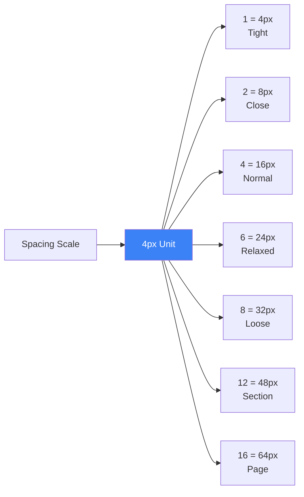

### Elevation & Shadows

| Level | Shadow | Usage |
|-------|--------|-------|
| 0 | none | Flat elements |
| 1 | `shadow-sm` | Cards, containers |
| 2 | `shadow-md` | Elevated cards |
| 3 | `shadow-lg` | Modals, dropdowns |
| 4 | `shadow-xl` | Overlays |

---

## User Interface Designs

### 1. Login Page Design

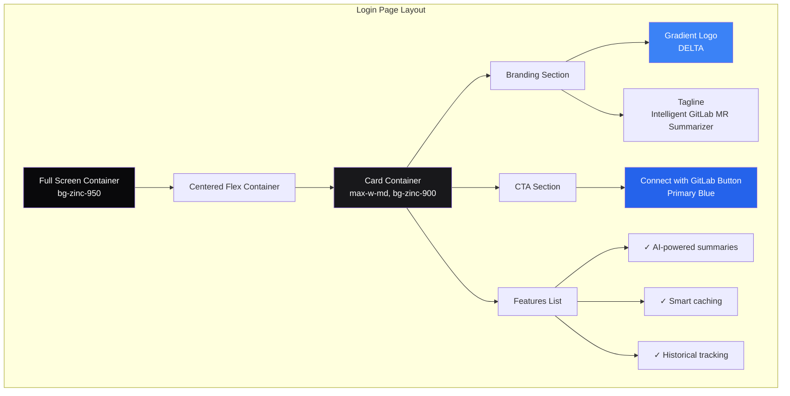

#### Login Page Wireframe

```
┌────────────────────────────────────────────────────┐
│                                                    │
│                                                    │
│              ╔══════════════════════╗              │
│              ║                      ║              │
│              ║   [DELTA Logo]       ║              │
│              ║   Gradient: Blue→Purple            │
│              ║                      ║              │
│              ║   Intelligent GitLab ║              │
│              ║   MR Summarizer      ║              │
│              ║   Powered by Azure OpenAI          │
│              ║                      ║              │
│              ║   ┌────────────────┐ ║              │
│              ║   │ Connect with   │ ║              │
│              ║   │ GitLab         │ ║              │
│              ║   └────────────────┘ ║              │
│              ║                      ║              │
│              ║   ✓ AI-powered...   ║              │
│              ║   ✓ Smart caching   ║              │
│              ║   ✓ Historical...   ║              │
│              ║                      ║              │
│              ╚══════════════════════╝              │
│                                                    │
│                                                    │
└────────────────────────────────────────────────────┘
```

### 2. Analysis Page Design

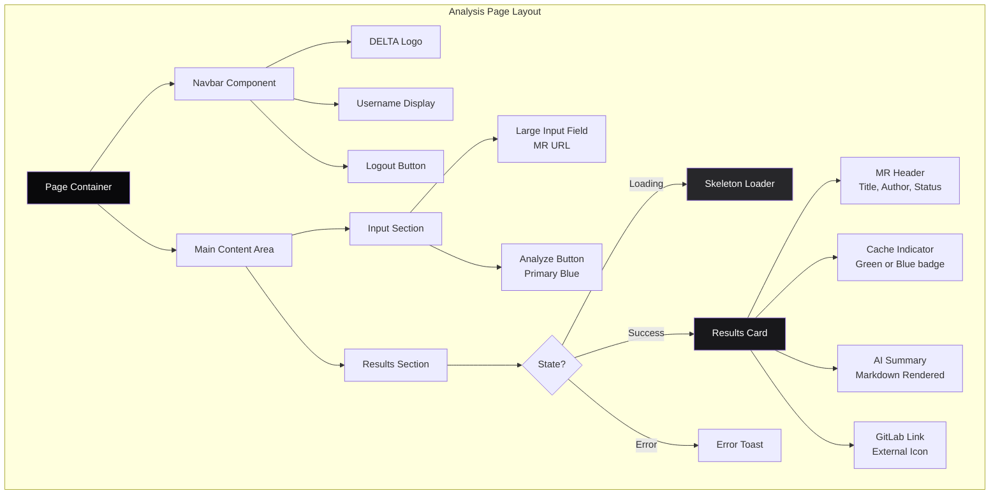

#### Analysis Page States

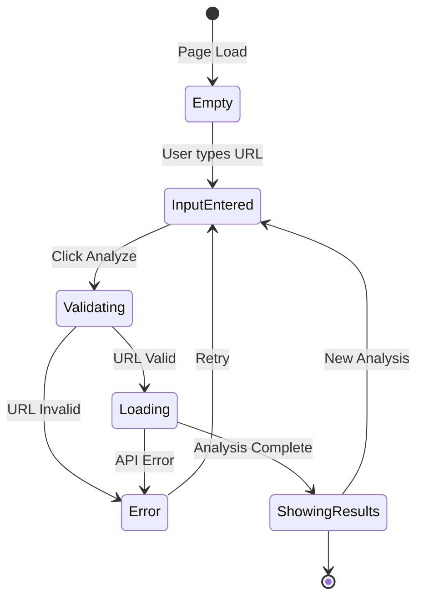

#### Analysis Page Wireframe

```
┌─────────────────────────────────────────────────────────────┐
│ [DELTA] ────────────────────────────── @username [Logout]   │
├─────────────────────────────────────────────────────────────┤
│                                                             │
│   Analysis  |  History                                      │
│   ========                                                  │
│                                                             │
│   ┌───────────────────────────────────────────────────┐    │
│   │ https://gitlab.com/group/proj/-/merge_requests/1  │    │
│   └───────────────────────────────────────────────────┘    │
│                                                             │
│                [Summarize Changes]                          │
│                                                             │
│   ┌───────────────────────────────────────────────────┐    │
│   │  Add user authentication feature        [Cached]  │    │
│   │  by John Doe • merged                             │    │
│   │  [View on GitLab ↗]                               │    │
│   │───────────────────────────────────────────────────│    │
│   │  ## Context                                       │    │
│   │  This MR implements OAuth 2.0 authentication...   │    │
│   │                                                   │    │
│   │  ## Key Changes                                   │    │
│   │  • Added GitLabService for OAuth integration     │    │
│   │  • Implemented JWT token management              │    │
│   │  • Created protected route wrapper               │    │
│   │                                                   │    │
│   │  ## Potential Risks                               │    │
│   │  • Token expiry handling needs monitoring        │    │
│   │  • HTTPS required in production                  │    │
│   └───────────────────────────────────────────────────┘    │
│                                                             │
└─────────────────────────────────────────────────────────────┘
```

### 3. History Page Design

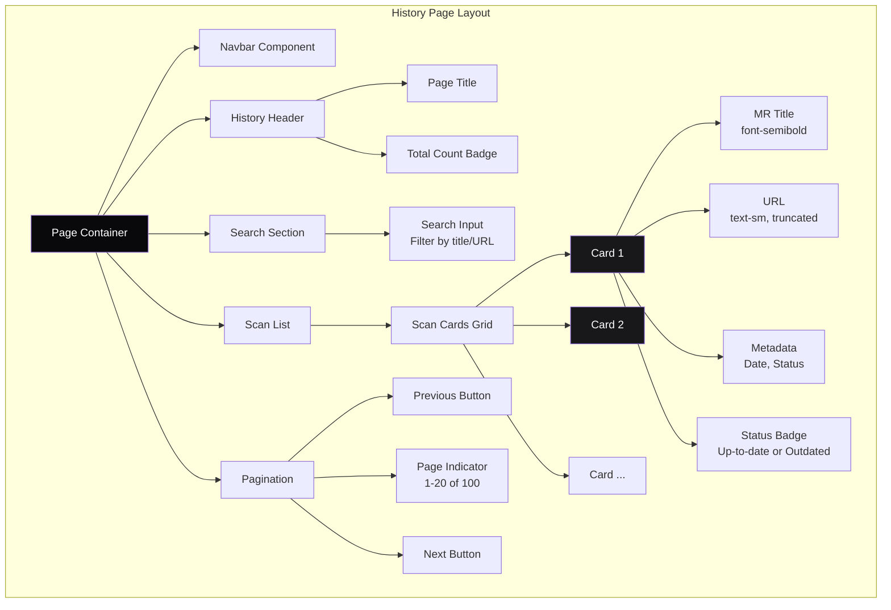

#### History Page Wireframe

```
┌─────────────────────────────────────────────────────────────┐
│ [DELTA] ────────────────────────────── @username [Logout]   │
├─────────────────────────────────────────────────────────────┤
│                                                             │
│   Analysis  |  History                                      │
│               ========                                      │
│                                                             │
│   Scan History                                   [42 total] │
│                                                             │
│   ┌─────────────────────────────────────────┐              │
│   │  Search scans...                       │              │
│   └─────────────────────────────────────────┘              │
│                                                             │
│   ┌──────────────────────────────────────────────────┐     │
│   │ Add user authentication feature      [Up-to-date]│     │
│   │ https://gitlab.com/.../merge_requests/123        │     │
│   │ Analyzed 2 hours ago                        ↗    │     │
│   └──────────────────────────────────────────────────┘     │
│                                                             │
│   ┌──────────────────────────────────────────────────┐     │
│   │ Fix database migration bug           [Outdated] │     │
│   │ https://gitlab.com/.../merge_requests/122        │     │
│   │ Analyzed 1 day ago                          ↗    │     │
│   └──────────────────────────────────────────────────┘     │
│                                                             │
│   ┌──────────────────────────────────────────────────┐     │
│   │ Implement caching layer              [Up-to-date]│     │
│   │ https://gitlab.com/.../merge_requests/121        │     │
│   │ Analyzed 3 days ago                         ↗    │     │
│   └──────────────────────────────────────────────────┘     │
│                                                             │
│   [← Previous]    Showing 1-20 of 42    [Next →]          │
│                                                             │
└─────────────────────────────────────────────────────────────┘
```

### 4. Loading States

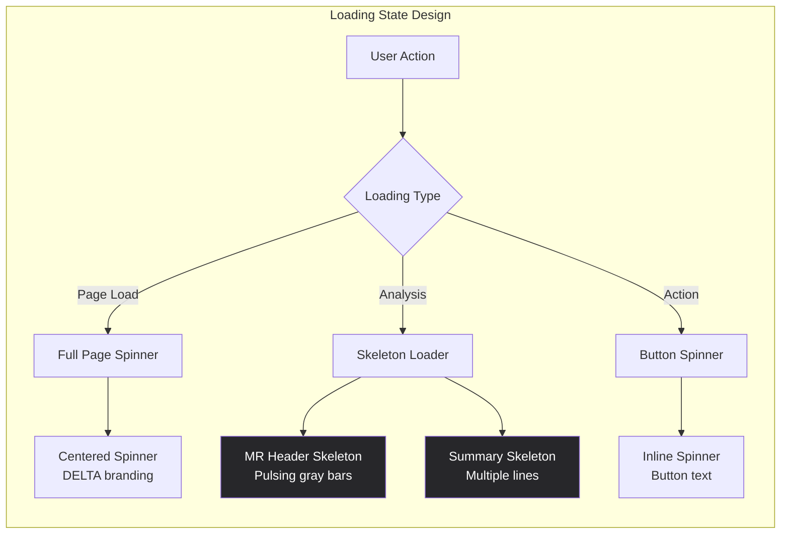

---

## Component Architecture

### Component Hierarchy

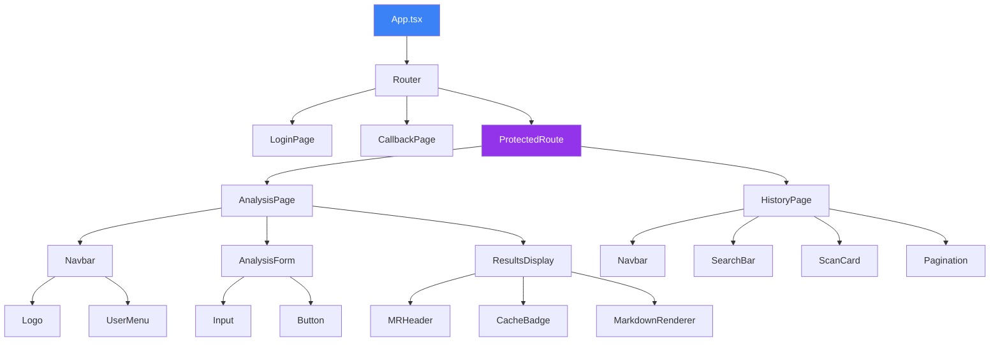

### Component Design Patterns

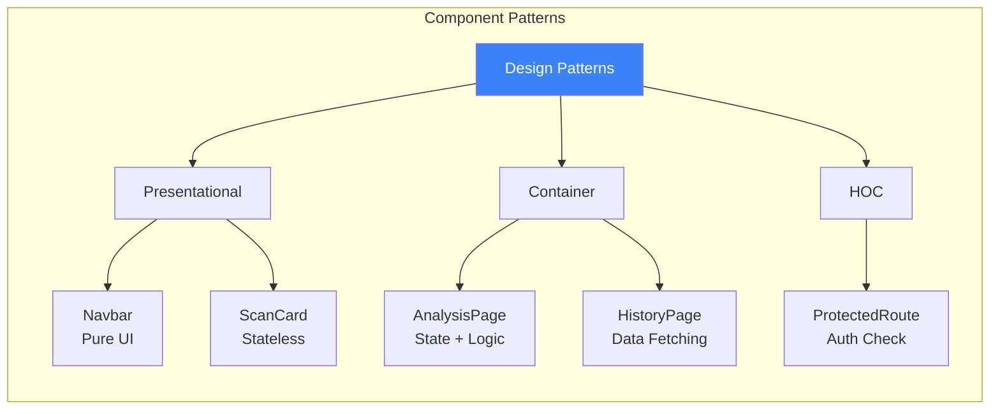

### Shared Component Library

| Component | Type | Props | Usage |
|-----------|------|-------|-------|
| `Button` | shadcn/ui | variant, size, onClick | Primary actions |
| `Input` | shadcn/ui | placeholder, value, onChange | Form fields |
| `Card` | shadcn/ui | className, children | Content containers |
| `Badge` | shadcn/ui | variant, children | Status indicators |
| `Navbar` | Custom | username, onLogout | Navigation |
| `ScanCard` | Custom | scan, onClick | History items |

---

## Interaction Design

### User Flow Diagram

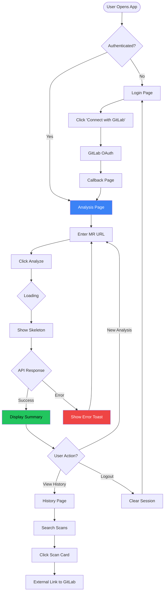

### Interaction States

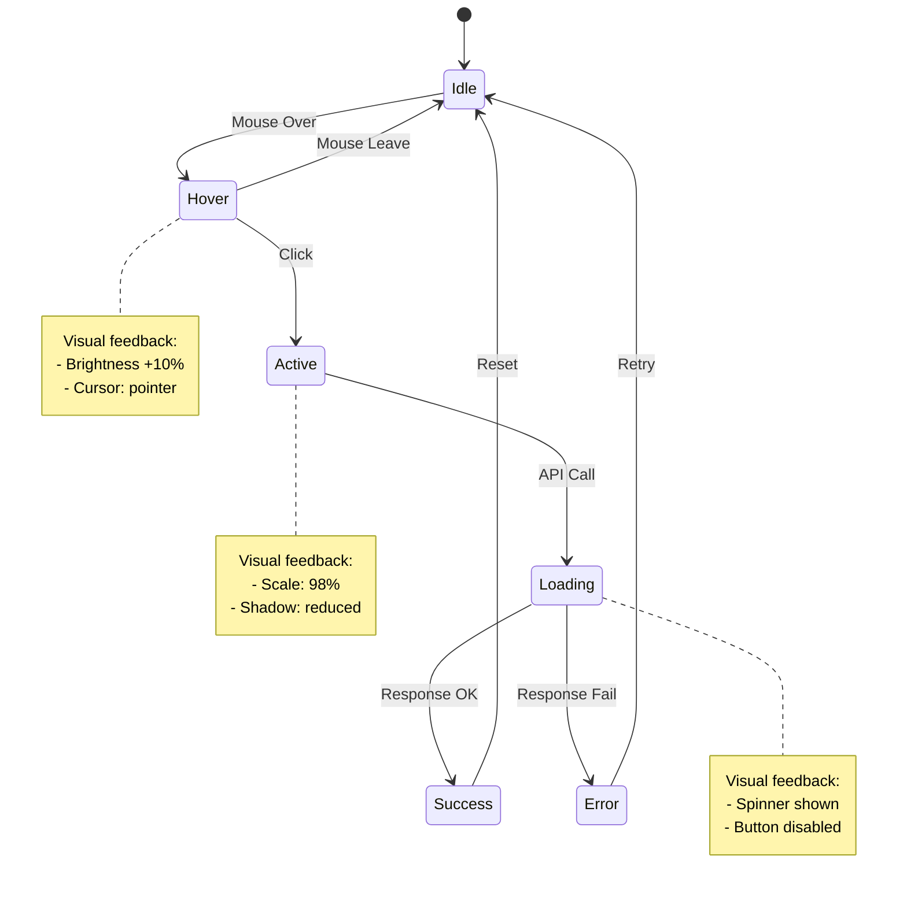

### Animation Specifications

| Element | Animation | Duration | Easing |
|---------|-----------|----------|--------|
| Button Hover | brightness(1.1) | 200ms | ease-in-out |
| Button Click | scale(0.98) | 100ms | ease-out |
| Card Hover | translateY(-2px) | 200ms | ease-out |
| Toast Enter | slideInRight | 300ms | ease-out |
| Toast Exit | slideOutRight | 200ms | ease-in |
| Skeleton Pulse | opacity(0.5-1) | 1500ms | ease-in-out |
| Page Transition | fadeIn | 300ms | ease-in |

---

## Responsive Design

### Breakpoint Strategy

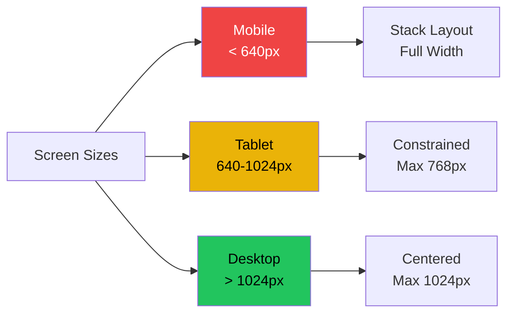

### Responsive Layout Rules

| Breakpoint | Login Card | Analysis Form | History Cards |
|------------|------------|---------------|---------------|
| Mobile (< 640px) | Full width, p-4 | Full width | Stack vertically |
| Tablet (640-1024px) | max-w-md | max-w-2xl | 1 column |
| Desktop (> 1024px) | max-w-md | max-w-4xl | 1 column |

**Note:** DELTA is desktop-first by design (target users are developers on workstations)

---

## Design Iterations

### Version 1.0: Initial Concept (2025-12-01)

```
┌─────────────────────────────────┐
│  DELTA                          │
│                                 │
│  [GitLab Login Button]          │
│                                 │
│  Simple, centered, minimal      │
└─────────────────────────────────┘
```

**Feedback:**
- ❌ Too minimal - doesn't convey value proposition
- ❌ No branding identity
- ❌ Looks incomplete

**Changes:**
- Added feature list
- Added gradient branding
- Added card container for elevation

---

### Version 2.0: Enhanced Branding (2025-12-03)

```
┌─────────────────────────────────┐
│  ╔════════════════════════╗     │
│  ║ DELTA (Gradient)       ║     │
│  ║ Intelligent GitLab...  ║     │
│  ║                        ║     │
│  ║ [Connect with GitLab]  ║     │
│  ║                        ║     │
│  ║ ✓ AI-powered summaries ║     │
│  ║ ✓ Smart caching        ║     │
│  ║ ✓ Historical tracking  ║     │
│  ╚════════════════════════╝     │
└─────────────────────────────────┘
```

**Feedback:**
- ✅ Much better branding
- ✅ Clear value proposition
- ⚠️ Could use more spacing

**Changes:**
- Increased padding in card
- Added subtle shadow for depth

---

### Version 3.0: Analysis Page (2025-12-06)

**Initial Design:**
- Simple text input + button
- Results in plain text

**Feedback:**
- ❌ Loading state not clear
- ❌ Results look unstructured
- ❌ No indication of cache status

**Changes:**
- Added skeleton loader
- Implemented markdown rendering
- Added cache badge indicator
- Added MR header with metadata

---

### Version 4.0: History Page (2025-12-08)

**Initial Design:**
- Simple list of MR titles

**Feedback:**
- ❌ Hard to scan quickly
- ❌ No indication of freshness
- ❌ Missing search functionality

**Changes:**
- Added card-based layout
- Added status badges (up-to-date/outdated)
- Implemented search bar
- Added pagination controls

---

### Version 5.0: Final Polish (2025-12-10)

**Refinements:**
- Consistent spacing throughout
- Unified color usage
- Improved loading states
- Better error messages
- Hover effects on all interactive elements

---

## Accessibility Considerations

### WCAG 2.1 Compliance Checklist

```mermaid
graph TD
    A[Accessibility] --> B[Perceivable]
    A --> C[Operable]
    A --> D[Understandable]
    A --> E[Robust]

    B --> B1[✅ High Contrast<br/>7:1 ratio]
    B --> B2[✅ Text Alternatives<br/>Alt text on icons]
    B --> B3[✅ Semantic HTML<br/>Proper headings]

    C --> C1[✅ Keyboard Navigation<br/>Tab order]
    C --> C2[✅ Focus Indicators<br/>Visible outlines]
    C --> C3[⚠️ Touch Targets<br/>44x44px minimum]

    D --> D1[✅ Clear Labels<br/>Form inputs]
    D --> D2[✅ Error Messages<br/>Descriptive]
    D --> D3[✅ Consistent Layout<br/>Predictable]

    E --> E1[✅ Valid HTML<br/>Semantic tags]
    E --> E2[✅ ARIA Labels<br/>Screen readers]
    E --> E3[✅ Progressive Enhancement<br/>Works without JS]

    style B1 fill:#22c55e,color:#000
    style B2 fill:#22c55e,color:#000
    style B3 fill:#22c55e,color:#000
    style C1 fill:#22c55e,color:#000
    style C2 fill:#22c55e,color:#000
    style C3 fill:#eab308,color:#000
    style D1 fill:#22c55e,color:#000
    style D2 fill:#22c55e,color:#000
    style D3 fill:#22c55e,color:#000
    style E1 fill:#22c55e,color:#000
    style E2 fill:#22c55e,color:#000
    style E3 fill:#22c55e,color:#000
```

### Color Contrast Ratios

| Foreground | Background | Ratio | WCAG Level |
|------------|------------|-------|------------|
| Zinc-950 | Zinc-50 | 19.36:1 | AAA ✅ |
| Zinc-500 | Zinc-50 | 9.14:1 | AAA ✅ |
| Blue-600 | White | 7.82:1 | AAA ✅ |
| Green-500 | Zinc-50 | 8.21:1 | AAA ✅ |
| Red-500 | Zinc-50 | 7.45:1 | AAA ✅ |

### Keyboard Navigation

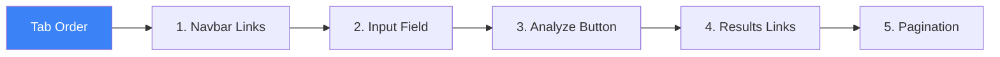

| Element | Keyboard Shortcut | Action |
|---------|------------------|--------|
| Input Field | Tab | Focus |
| Analyze Button | Enter (when focused) | Submit |
| MR URL Input | Enter (inside input) | Submit form |
| Logout Button | Tab + Enter | Logout |
| External Links | Tab + Enter | Open in new tab |

### Screen Reader Support

| Element | ARIA Label | Purpose |
|---------|------------|---------|
| Login Button | "Connect with GitLab to authenticate" | Clear action |
| Input Field | "Enter GitLab merge request URL" | Context |
| Analyze Button | "Analyze merge request" | Action |
| Cache Badge | "This result is cached" | Status |
| Status Badge | "Merge request status: merged" | State info |
| Search Input | "Search scan history by title or URL" | Purpose |

---

## Design System Tools

### Figma Component Library (Conceptual)

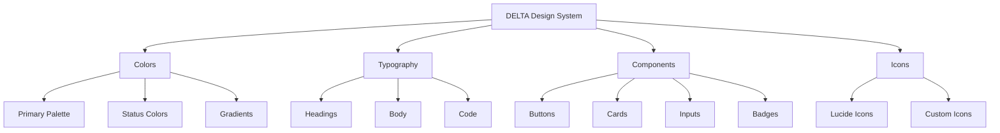

### Tailwind Configuration

```javascript
// Documented in tailwind.config.ts
theme: {
  extend: {
    colors: {
      zinc: { /* Custom zinc scale */ },
      blue: { /* Custom blue scale */ },
    },
    fontFamily: {
      sans: ['Inter', 'sans-serif'],
      mono: ['JetBrains Mono', 'monospace'],
    },
    animation: {
      'pulse-slow': 'pulse 2s cubic-bezier(0.4, 0, 0.6, 1) infinite',
    },
  },
}
```

---

## Design Decision Log

| ID | Decision | Rationale | Date |
|----|----------|-----------|------|
| DES-001 | Use light theme with shadcn/ui | Provides professional, enterprise-grade appearance | 2025-12-01 |
| DES-002 | Zinc over pure black | Better on OLED, less eye strain | 2025-12-01 |
| DES-003 | Blue as primary color | Industry standard for trust/tech | 2025-12-02 |
| DES-004 | Card-based layout | Modern, clear hierarchy | 2025-12-03 |
| DES-005 | Skeleton loaders over spinners | Better perceived performance | 2025-12-06 |
| DES-006 | Markdown rendering | Allows AI to format summaries | 2025-12-07 |
| DES-007 | Gradient branding | Differentiates from generic apps | 2025-12-08 |
| DES-008 | shadcn/ui components | Enterprise-grade, accessible | 2025-12-01 |

---

## Future Design Enhancements

### Roadmap

| Feature | Priority | Complexity | Design Impact |
|---------|----------|------------|---------------|
| shadcn/ui Integration | Completed | High | Implemented in refactor |
| Customizable Themes | P3 | High | Theme system architecture |
| Mobile Optimization | P2 | Medium | Responsive redesign |
| PDF Export | P3 | Low | Print stylesheet |
| Dashboard View | P3 | High | New page design |
| Collaborative Comments | P4 | Very High | New interaction model |

---

## Appendix: Design Tools Used

1. **Figma** (Conceptual) - UI mockups and prototyping
2. **TailwindCSS v4** - Utility-first styling
3. **shadcn/ui** - Component library
4. **Lucide React** - Icon system
5. **React Markdown** - Markdown rendering
6. **Mermaid** - Diagram generation (this document)

---

**Document Version:** 2.0
**Last Updated:** 2025-12-11
**Next Review:** Post-IPA submission

**End of Design Documentation**
