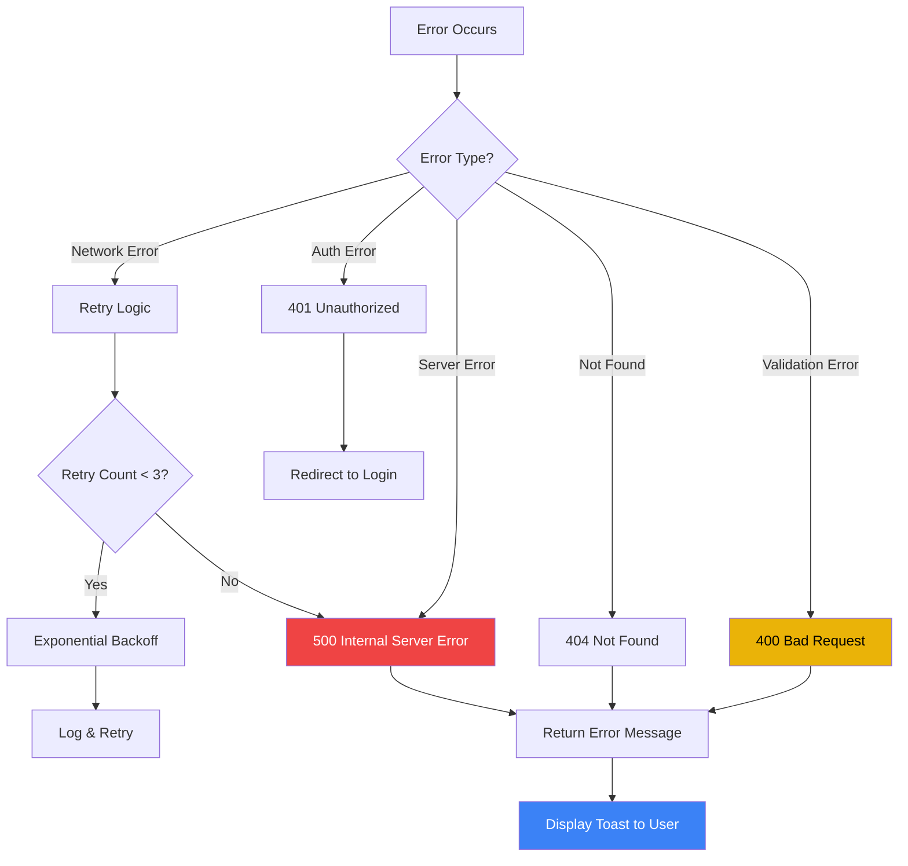
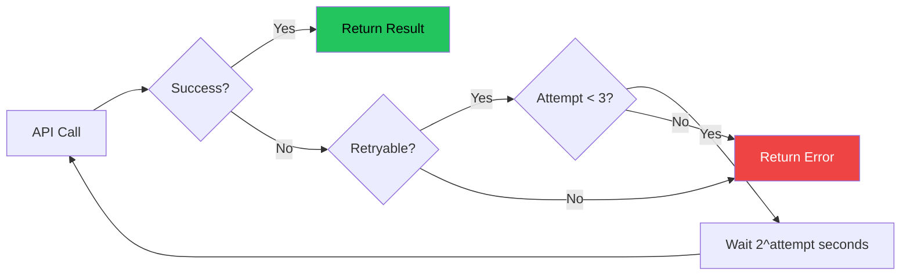
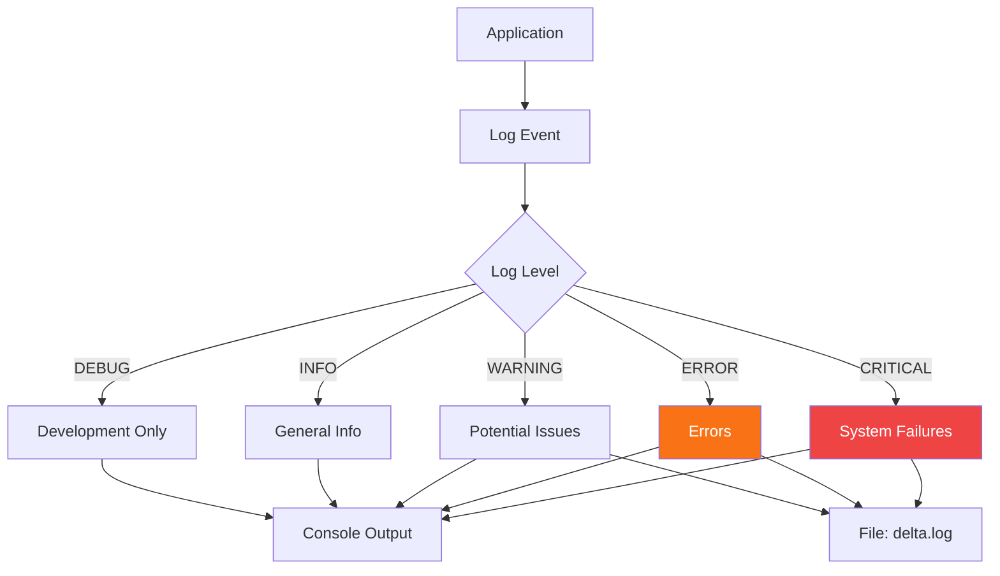
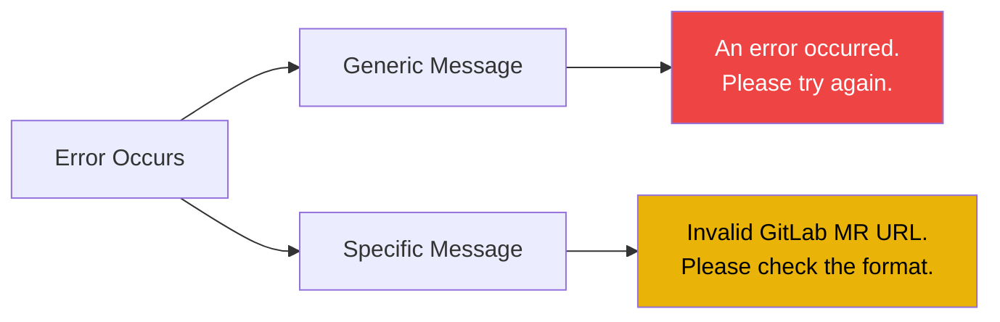

# Error Handling & Logging Strategy (G16)

**Project:** DELTA - Diff Explanation & Linguistic Transformation Assistant
**Document Type:** Fehlerbehandlung und Protokollierung
**Version:** 2.0
**Last Updated:** 2025-12-11

## Executive Summary

This document details the error handling and logging strategy for DELTA, demonstrating compliance with **G16: Fehlerbehandlung und Protokollierung**.

---

## Error Handling Flow



---

## HTTP Error Codes

| Code | Name | Usage | Frontend Action |
|------|------|-------|-----------------|
| 200 | OK | Success | Display result |
| 400 | Bad Request | Invalid input | Show error toast |
| 401 | Unauthorized | Auth required | Redirect to /login |
| 404 | Not Found | Resource missing | Show error toast |
| 500 | Internal Server Error | Server failure | Show generic error |

---

## Retry Strategy



### Retry Implementation

```python
# backend/app/services/openai_service.py
async def generate_summary(...):
    for attempt in range(3):
        try:
            return await self._call_api(...)
        except OpenAIError as e:
            if attempt == 2:
                raise
            await asyncio.sleep(2 ** attempt)
```

---

## Logging Architecture



---

## Error Catalog

### Backend Errors

| Error Code | Type | Message | Resolution |
|------------|------|---------|------------|
| AUTH-001 | Unauthorized | "Could not validate credentials" | Re-login |
| AUTH-002 | Forbidden | "Access denied to resource" | Check permissions |
| GL-001 | GitLab API | "Merge request not found" | Verify URL |
| GL-002 | GitLab API | "GitLab API error" | Retry later |
| AI-001 | OpenAI | "Failed to generate summary" | Retry analysis |
| AI-002 | OpenAI | "Rate limit exceeded" | Wait & retry |
| DB-001 | Database | "Database error" | Contact admin |
| VAL-001 | Validation | "Invalid GitLab MR URL" | Check URL format |

### Frontend Errors

| Error Code | Component | Message | User Action |
|------------|-----------|---------|-------------|
| UI-001 | AnalysisPage | "Please enter a valid MR URL" | Fix URL |
| UI-002 | API Client | "Network error. Please try again" | Retry |
| UI-003 | Protected Route | "Please login to continue" | Login |

---

## Logging Examples

### Success Logging
```
[2025-12-09 14:23:45] [INFO] Analyzing MR: https://gitlab.com/group/proj/-/merge_requests/123
[2025-12-09 14:23:46] [INFO] Project: group/proj, MR: !123
[2025-12-09 14:23:47] [INFO] Current SHA: abc123def456
[2025-12-09 14:23:47] [INFO] Cache HIT! Returning cached summary
[2025-12-09 14:23:47] [INFO] Analysis complete! Scan ID: 1
```

### Error Logging
```
[2025-12-09 15:10:23] [ERROR] Failed to fetch MR group/proj!999: 404 Not Found
[2025-12-09 15:10:23] [ERROR] Merge request not found or you don't have access to it.
```

---

## User-Facing Error Messages



### Toast Notification Examples

**Success:**
```
✅ Analysis complete!
```

**Error:**
```
❌ Failed to analyze MR. Please try again.
```

**Warning:**
```
⚠️ This MR has not been updated since last analysis.
```

---

## Error Handling Best Practices

1. **Never expose sensitive info** - Generic errors to users
2. **Log everything** - Detailed logs for debugging
3. **Retry transient errors** - Network, rate limits
4. **Fail fast on validation** - Don't retry bad input
5. **User-friendly messages** - Clear next steps

---

**End of Error Handling Documentation**
