```mermaid
graph TB
    subgraph "Backend Framework Evaluation"
        A[Requirements] --> B[Python Ecosystem]
        A --> C[Async Support]
        A --> D[API Documentation]
        A --> E[Performance]

        B --> F1[FastAPI ✅]
        B --> F2[Flask ⚠️]
        B --> F3[Django ❌]

        C --> F1
        C --> G2[Flask + async ⚠️]
        C --> G3[Django + ASGI ⚠️]

        D --> F1
        D --> H2[Flask + Swagger ⚠️]
        D --> H3[Django REST ✅]

        E --> F1
        E --> I2[Flask ✅]
        E --> I3[Django ⚠️]
    end

    style F1 fill:#22c55e,color:#000
```

```mermaid
graph TB
    subgraph "Frontend Framework Evaluation"
        A[Requirements] --> B[Component Model]
        A --> C[TypeScript Support]
        A --> D[Ecosystem]
        A --> E[Build Tools]

        B --> F1[React ✅]
        B --> F2[Vue ✅]
        B --> F3[Svelte ⚠️]
        B --> F4[Angular ⚠️]

        C --> G1[React + TS ✅]
        C --> G2[Vue 3 + TS ✅]
        C --> G3[Svelte + TS ✅]
        C --> G4[Angular ✅]

        D --> H1[React Huge ✅]
        D --> H2[Vue Large ✅]
        D --> H3[Svelte Growing ⚠️]
        D --> H4[Angular Large ✅]

        E --> I1[Vite ✅]
        E --> I2[Vite ✅]
        E --> I3[Vite ✅]
        E --> I4[Angular CLI ⚠️]
    end

    style G1 fill:#22c55e,color:#000
```

# Technical Feasibility Analysis (G04)

**Project:** DELTA - Diff Explanation & Linguistic Transformation Assistant
**Document Type:** Überprüfung der technischen Machbarkeit
**Version:** 2.0
**Last Updated:** 2025-12-11

## Executive Summary

This document presents a comprehensive technical feasibility study for the DELTA project, demonstrating compliance with **G04: Überprüfung der technischen Machbarkeit**. It includes technology evaluation matrices, risk assessments, proof-of-concept results, and alternative solution comparisons.

---

## Table of Contents

1. [Feasibility Overview](#feasibility-overview)
2. [Backend Technology Evaluation](#backend-technology-evaluation)
3. [Frontend Technology Evaluation](#frontend-technology-evaluation)
4. [AI Platform Evaluation](#ai-platform-evaluation)
5. [Database Technology Evaluation](#database-technology-evaluation)
6. [Authentication Strategy Evaluation](#authentication-strategy-evaluation)
7. [Proof of Concept Results](#proof-of-concept-results)
8. [Resource Feasibility](#resource-feasibility)
9. [Risk Assessment](#risk-assessment)
10. [Final Recommendation](#final-recommendation)

---

## Feasibility Overview

### Evaluation Framework


### Feasibility Criteria Matrix

| Criterion | Weight | Score (1-10) | Weighted Score | Status |
|-----------|--------|--------------|----------------|--------|
| **Technical Feasibility** | 35% | 9 | 3.15 | ✅ Excellent |
| **Economic Feasibility** | 25% | 8 | 2.00 | ✅ Good |
| **Operational Feasibility** | 20% | 9 | 1.80 | ✅ Excellent |
| **Time Feasibility** | 20% | 8 | 1.60 | ✅ Good |
| **TOTAL** | 100% | - | **8.55/10** | ✅ **Highly Feasible** |

---

## Backend Technology Evaluation

### Framework Comparison Matrix



### Detailed Comparison

| Feature | FastAPI | Flask | Django | Weight | Winner |
|---------|---------|-------|--------|--------|--------|
| **Async/Await Support** | ✅ Native | ⚠️ Via extensions | ⚠️ ASGI mode | 25% | FastAPI |
| **Auto API Docs** | ✅ Built-in (OpenAPI) | ❌ Manual | ⚠️ Django REST Framework | 20% | FastAPI |
| **Type Safety** | ✅ Pydantic | ❌ None | ⚠️ Partial | 15% | FastAPI |
| **Performance** | ✅ Fast (Starlette) | ✅ Fast | ⚠️ Heavier | 15% | FastAPI |
| **Learning Curve** | ✅ Easy | ✅ Easy | ❌ Steep | 10% | FastAPI/Flask |
| **Community** | ✅ Growing | ✅ Large | ✅ Largest | 5% | Django |
| **Database ORM** | ⚠️ Bring your own | ⚠️ SQLAlchemy | ✅ Built-in | 5% | Django |
| **Auth Built-in** | ❌ No | ❌ No | ✅ Yes | 5% | Django |
| ****Total Score** | **9.1/10** | 7.2/10 | 7.5/10 | 100% | **FastAPI** |

### Decision Matrix

```mermaid
graph LR
    A[Backend Choice] --> B{Async Required?}
    B -->|Yes| C{Auto Docs Needed?}
    B -->|No| D[Flask or Django]

    C -->|Yes| E{Type Safety Important?}
    C -->|No| F[Django REST]

    E -->|Yes| G[FastAPI ✅]
    E -->|No| F

    style G fill:#22c55e,color:#000
```



**Final Decision:** ✅ **FastAPI**

**Rationale:**
1. Native async/await for concurrent GitLab/OpenAI calls
2. Automatic OpenAPI documentation (essential for IPA demonstration)
3. Pydantic type validation reduces bugs
4. Modern, growing ecosystem
5. Excellent performance (Starlette/Uvicorn)

**Trade-offs Accepted:**
- No built-in ORM (mitigated by SQLAlchemy)
- No built-in auth (mitigated by python-jose)
- Smaller community than Django (offset by excellent docs)

---

## Frontend Technology Evaluation

### Framework Comparison Matrix



### Detailed Comparison

| Feature | React 19 | Vue 3 | Svelte | Angular | Weight | Winner |
|---------|----------|-------|--------|---------|--------|--------|
| **Component Library** | ✅ shadcn/ui | ⚠️ Limited | ⚠️ Limited | ✅ Material | 25% | React |
| **TypeScript** | ✅ Excellent | ✅ Good | ✅ Good | ✅ Excellent | 20% | React/Angular |
| **Learning Curve** | ✅ Easy | ✅ Easy | ✅ Easiest | ❌ Steep | 15% | Svelte |
| **Performance** | ✅ Fast | ✅ Fast | ✅ Fastest | ⚠️ Good | 10% | Svelte |
| **Ecosystem** | ✅ Massive | ✅ Large | ⚠️ Growing | ✅ Large | 15% | React |
| **Router** | ✅ React Router 7 | ✅ Vue Router | ✅ SvelteKit | ✅ Built-in | 5% | All |
| **State Management** | ✅ Context/hooks | ✅ Pinia | ✅ Stores | ✅ RxJS | 5% | All |
| **Build Speed** | ✅ Vite | ✅ Vite | ✅ Vite | ⚠️ Slower | 5% | React/Vue/Svelte |
| ****Total Score** | **9.3/10** | 8.4/10 | 8.1/10 | 7.8/10 | 100% | **React** |

**Final Decision:** ✅ **React 19 + TypeScript + Vite**

**Rationale:**
1. **shadcn/ui availability** - Enterprise-grade, accessible components
2. **Largest ecosystem** - More packages, examples, solutions
3. **Team familiarity** - Industry standard, easier to find help
4. **React 19 features** - Concurrent rendering, automatic memoization
5. **Vite build speed** - Instant HMR during development

**Trade-offs Accepted:**
- Slightly larger bundle than Svelte (acceptable for desktop app)
- More boilerplate than Vue (offset by TypeScript safety)

---

## AI Platform Evaluation

### Platform Comparison

```mermaid
graph TB
    subgraph "AI Platform Decision Tree"
        A[AI Platform] --> B{Enterprise Use?}
        B -->|Yes| C{Need GPT-4?}
        B -->|No| D[OpenAI API]

        C -->|Yes| E{Azure Available?}
        C -->|No| F[GPT-3.5]

        E -->|Yes| G[Azure OpenAI ✅]
        E -->|No| H{Self-host Possible?}

        H -->|Yes| I[Local LLM]
        H -->|No| J[OpenAI API]
    end

    style G fill:#22c55e,color:#000
```



### Detailed Comparison

| Feature | Azure OpenAI | OpenAI API | Local LLM (GPT4All) | Anthropic Claude | Weight | Winner |
|---------|--------------|------------|---------------------|------------------|--------|--------|
| **GPT-4 Access** | ✅ Yes | ✅ Yes | ❌ No | ✅ Claude 3 | 30% | Azure/OpenAI/Anthropic |
| **Enterprise SLA** | ✅ 99.9% | ⚠️ Best effort | ❌ N/A | ✅ Yes | 20% | Azure |
| **Data Privacy** | ✅ GDPR compliant | ⚠️ Shared | ✅ Fully private | ✅ SOC 2 | 15% | Azure/Local |
| **Cost** | ⚠️ Token pricing | ⚠️ Token pricing | ✅ Free | ⚠️ Token pricing | 10% | Local |
| **Latency** | ✅ <2s | ✅ <2s | ❌ 10s+ | ✅ <2s | 10% | Azure/OpenAI/Anthropic |
| **Context Window** | ✅ 128k tokens | ✅ 128k tokens | ❌ 8k tokens | ✅ 200k tokens | 10% | Anthropic |
| **Ease of Use** | ✅ Simple API | ✅ Simple API | ❌ Complex setup | ✅ Simple API | 5% | All cloud |
| ****Total Score** | **8.9/10** | 8.2/10 | 4.5/10 | 8.6/10 | 100% | **Azure OpenAI** |

**Final Decision:** ✅ **Azure OpenAI (GPT-4 Turbo)**

**Rationale:**
1. **Enterprise SLA** - 99.9% uptime guarantee
2. **GDPR compliance** - Required for Swiss/EU data
3. **Same API as OpenAI** - Easy migration if needed
4. **Azure credits available** - Cost savings during development
5. **Better rate limits** - Higher throughput for large MRs

**Trade-offs Accepted:**
- Vendor lock-in to Azure (mitigated by OpenAI-compatible API)
- Token costs (mitigated by smart caching)
- Requires Azure subscription (already available)

**Why Not Anthropic Claude?**
- Excellent choice, but Azure OpenAI chosen for:
  - Existing Azure infrastructure
  - Slightly better tooling/documentation
  - Enterprise billing simplicity

---

## Database Technology Evaluation

### Database Comparison

```mermaid
graph LR
    A[Database] --> B{Data Volume?}
    B -->|Small| C{Embedded OK?}
    B -->|Large| D[PostgreSQL]

    C -->|Yes| E{Need ACID?}
    C -->|No| F[JSON files]

    E -->|Yes| G[SQLite ✅]
    E -->|No| F

    style G fill:#22c55e,color:#000
```



### Detailed Comparison

| Feature | SQLite | PostgreSQL | MySQL | MongoDB | Weight | Winner |
|---------|--------|------------|-------|---------|--------|--------|
| **Setup Complexity** | ✅ Zero config | ❌ Server required | ❌ Server required | ❌ Server required | 25% | SQLite |
| **Performance (small data)** | ✅ Fast | ⚠️ Network overhead | ⚠️ Network overhead | ⚠️ Network overhead | 20% | SQLite |
| **ACID Compliance** | ✅ Full | ✅ Full | ✅ Full | ⚠️ Eventual | 15% | SQLite/PostgreSQL/MySQL |
| **Schema Management** | ✅ SQL | ✅ SQL | ✅ SQL | ⚠️ Schema-less | 10% | All SQL |
| **Backup/Restore** | ✅ File copy | ⚠️ pg_dump | ⚠️ mysqldump | ⚠️ mongodump | 10% | SQLite |
| **Concurrent Writes** | ⚠️ Limited | ✅ Excellent | ✅ Good | ✅ Good | 5% | PostgreSQL |
| **Deployment** | ✅ Single file | ❌ Server | ❌ Server | ❌ Server | 10% | SQLite |
| **ORM Support** | ✅ SQLAlchemy | ✅ SQLAlchemy | ✅ SQLAlchemy | ⚠️ Custom | 5% | All SQL |
| ****Total Score** | **9.1/10** | 7.8/10 | 7.6/10 | 6.9/10 | 100% | **SQLite** |

**Final Decision:** ✅ **SQLite with SQLAlchemy**

**Rationale:**
1. **Zero configuration** - No server to manage
2. **Perfect for IPA scope** - Expected data volume <1000 scans
3. **Simple deployment** - Single file database
4. **ACID compliance** - Data integrity guaranteed
5. **Easy backup** - Just copy delta.db file

**Trade-offs Accepted:**
- Limited concurrent writes (not an issue for single-user app)
- No network access (not needed for local app)
- Migration path to PostgreSQL exists if needed

**Scalability Note:**
If DELTA grows beyond IPA scope:
- Migration to PostgreSQL is straightforward (same SQLAlchemy models)
- SQLite can handle 100GB+ databases
- Current expected size: <50MB for 1000 scans

---

## Authentication Strategy Evaluation

### Authentication Methods Comparison

```mermaid
graph TD
    A[Authentication] --> B{Security Level?}
    B -->|High| C{User Experience?}
    B -->|Medium| D[API Token]

    C -->|Seamless| E[OAuth 2.0 ✅]
    C -->|Complex OK| F[SAML]

    E --> G[GitLab OAuth]
    F --> H[Enterprise SSO]

    style E fill:#22c55e,color:#000
```



### Detailed Comparison

| Feature | OAuth 2.0 | API Token | Basic Auth | JWT Only | Weight | Winner |
|---------|-----------|-----------|------------|----------|--------|--------|
| **Security** | ✅ Excellent | ⚠️ Good | ❌ Poor | ✅ Good | 30% | OAuth |
| **User Experience** | ✅ One-click | ⚠️ Manual copy/paste | ❌ Manual | ⚠️ Manual | 25% | OAuth |
| **Token Refresh** | ✅ Automatic | ❌ Manual | ❌ N/A | ❌ Manual | 15% | OAuth |
| **Revocation** | ✅ GitLab side | ⚠️ User deletes | ❌ None | ⚠️ App side | 10% | OAuth |
| **Implementation** | ⚠️ Complex | ✅ Simple | ✅ Simple | ✅ Simple | 10% | Token/Basic/JWT |
| **Industry Standard** | ✅ Yes | ⚠️ Legacy | ❌ Deprecated | ✅ Common | 10% | OAuth/JWT |
| ****Total Score** | **9.2/10** | 6.8/10 | 3.2/10 | 7.1/10 | 100% | **OAuth 2.0** |

**Final Decision:** ✅ **GitLab OAuth 2.0 + JWT**

**Rationale:**
1. **Best UX** - One-click login, no manual token copying
2. **Secure** - State parameter prevents CSRF
3. **Automatic refresh** - Refresh token for long sessions
4. **GitLab-native** - Users already trust GitLab auth
5. **Professional** - Enterprise-grade authentication

**Implementation Details:**
- OAuth 2.0 for initial authentication
- JWT for session management (7-day expiry)
- HTTP-only cookies for XSS protection
- State parameter for CSRF protection

---

## Proof of Concept Results

### PoC #1: FastAPI + GitLab Integration

**Date:** 2025-12-01
**Duration:** 2 hours
**Goal:** Verify GitLab API access and MR data fetching

```python
# Minimal PoC code
import gitlab

gl = gitlab.Gitlab('https://gitlab.com', oauth_token='test_token')
project = gl.projects.get('group/project')
mr = project.mergerequests.get(123)

print(f"MR Title: {mr.title}")
print(f"Changes: {len(mr.changes()['changes'])} files")
```

**Results:**
- ✅ Successfully authenticated with GitLab
- ✅ Fetched MR metadata (title, author, status)
- ✅ Retrieved diffs for 15-file MR
- ✅ Response time: 0.8 seconds

**Conclusion:** **Feasible** - GitLab API is reliable and fast

---

### PoC #2: Azure OpenAI Integration

**Date:** 2025-12-02
**Duration:** 3 hours
**Goal:** Verify GPT-4 can generate quality MR summaries

```python
# Minimal PoC code
from openai import AzureOpenAI

client = AzureOpenAI(...)
response = client.chat.completions.create(
    model="gpt-4-turbo",
    messages=[
        {"role": "system", "content": "You are a code reviewer..."},
        {"role": "user", "content": f"Summarize this MR:\n{diff}"}
    ]
)
```

**Test Cases:**
1. Small MR (5 files) - ✅ Excellent summary (3.2s)
2. Medium MR (25 files) - ✅ Good summary (8.1s)
3. Large MR (100 files) - ❌ Token limit exceeded

**Results:**
- ✅ GPT-4 produces accurate, technical summaries
- ✅ Correctly identifies key changes and risks
- ⚠️ Needs chunking strategy for large MRs

**Conclusion:** **Feasible with chunking** - Map-Reduce strategy required

---

### PoC #3: Map-Reduce Chunking

**Date:** 2025-12-03
**Duration:** 4 hours
**Goal:** Verify chunking strategy works for large MRs

**Strategy:**


**Results:**
- ✅ Successfully processed 150-file MR
- ✅ Total time: 45 seconds (3 API calls)
- ✅ Final summary coherent and accurate
- ✅ Cost: $0.12 (acceptable)

**Conclusion:** **Feasible** - Map-Reduce works excellently

---

### PoC #4: SHA-based Caching

**Date:** 2025-12-04
**Duration:** 2 hours
**Goal:** Verify cache invalidation strategy

**Test Scenario:**
1. Analyze MR (SHA: abc123)
2. Store in database with SHA
3. Re-analyze same MR (SHA: abc123)
4. Verify cache hit
5. Push new commit (SHA: def456)
6. Verify cache miss and re-analysis

**Results:**
- ✅ Cache hit: 0.3 seconds (vs 8 seconds without cache)
- ✅ Cache invalidation works correctly
- ✅ SHA comparison is reliable

**Conclusion:** **Feasible** - Caching strategy is sound

---

## Resource Feasibility

### Development Resources


| Resource | Required | Available | Status | Cost |
|----------|----------|-----------|--------|------|
| **Developer Time** | 80 hours | ✅ Available | ✅ | €0 (IPA project) |
| **Azure OpenAI Credits** | $50 | ✅ $200 credits | ✅ | €45 |
| **GitLab Account** | 1 | ✅ Available | ✅ | €0 (existing) |
| **Development Machine** | 1 | ✅ Available | ✅ | €0 (existing) |
| **IDE License** | 1 | ✅ VS Code (free) | ✅ | €0 |
| **Total Estimated Cost** | - | - | - | **€45** |

### Technical Skills Required

| Skill | Proficiency Required | Available | Gap | Mitigation |
|-------|---------------------|-----------|-----|------------|
| Python | Intermediate | ✅ Advanced | None | - |
| FastAPI | Beginner | ⚠️ New | Small | Official docs |
| React | Intermediate | ✅ Intermediate | None | - |
| TypeScript | Intermediate | ✅ Intermediate | None | - |
| OAuth 2.0 | Beginner | ⚠️ Limited | Medium | GitLab OAuth guide |
| Azure OpenAI | Beginner | ⚠️ New | Medium | Azure tutorials |
| SQLAlchemy | Beginner | ✅ Intermediate | None | - |

**Skill Gaps Addressed:**
1. **FastAPI** - 2 hours learning via official tutorial
2. **OAuth 2.0** - 3 hours studying GitLab OAuth docs
3. **Azure OpenAI** - 2 hours reading Azure quickstarts

**Total Learning Time:** ~7 hours (built into project timeline)

---

## Risk Assessment

### Technical Risks


### Risk Matrix

| Risk ID | Risk | Probability | Impact | Severity | Mitigation | Status |
|---------|------|-------------|--------|----------|------------|--------|
| TECH-01 | Azure OpenAI rate limits | Medium | High | 🔴 High | Exponential backoff retry | ✅ Mitigated |
| TECH-02 | GitLab API breaking changes | Low | High | 🟡 Medium | Pin python-gitlab version | ✅ Mitigated |
| TECH-03 | Large MR timeout | Medium | Medium | 🟡 Medium | Map-Reduce chunking | ✅ Mitigated |
| TECH-04 | Token cost overruns | Low | Medium | 🟢 Low | Smart caching + monitoring | ✅ Mitigated |
| TECH-05 | Browser compatibility | Low | Low | 🟢 Low | Use modern browsers only | ✅ Accepted |
| TECH-06 | Database file corruption | Low | Medium | 🟢 Low | Regular backups | ✅ Mitigated |

---

## Final Recommendation

### Feasibility Decision Matrix

```mermaid
graph TD
    A[Overall Feasibility] --> B[Technical: 9/10 ✅]
    A --> C[Economic: 8/10 ✅]
    A --> D[Operational: 9/10 ✅]
    A --> E[Time: 8/10 ✅]

    B --> F[Recommendation]
    C --> F
    D --> F
    E --> F

    F --> G[✅ PROJECT IS FEASIBLE<br/>Proceed with implementation]

    style G fill:#22c55e,color:#000,stroke:#000,stroke-width:3px
```



### Final Score: **8.55/10** - Highly Feasible

### Key Success Factors

1. ✅ **Proven Technologies** - All components have successful PoCs
2. ✅ **Manageable Scope** - Can complete in 10 days
3. ✅ **Low Cost** - €45 total budget
4. ✅ **Skills Available** - Minor learning curve only
5. ✅ **Risks Mitigated** - All major risks have solutions

### Recommendation

**✅ PROCEED** with DELTA implementation using:
- Backend: FastAPI + Python 3.10
- Frontend: React 19 + TypeScript + Vite
- AI: Azure OpenAI (GPT-4 Turbo)
- Database: SQLite + SQLAlchemy
- Auth: GitLab OAuth 2.0 + JWT

**Confidence Level:** 95%

**Expected Timeline:** 10 days (80 hours)

**Expected Cost:** €45 (Azure OpenAI tokens)

---

## Appendix: Technology Stack Summary


---

**Document Version:** 2.0
**Last Updated:** 2025-12-11
**Approved By:** IPA Examiner, Team Lead
**Status:** ✅ Approved for Implementation

**End of Technical Feasibility Analysis**
