# Implementation Plan & Timeline (G09)

**Project:** DELTA - Diff Explanation & Linguistic Transformation Assistant
**Document Type:** Ausarbeitung des Realisierungskonzepts
**Version:** 2.0
**Last Updated:** 2025-12-11

## Executive Summary

This document details the complete implementation plan for DELTA, demonstrating compliance with **G09: Ausarbeitung des Realisierungskonzepts**. It includes Gantt charts, resource allocation, risk mitigation timelines, and milestone deliverables.

---

## Project Timeline Overview

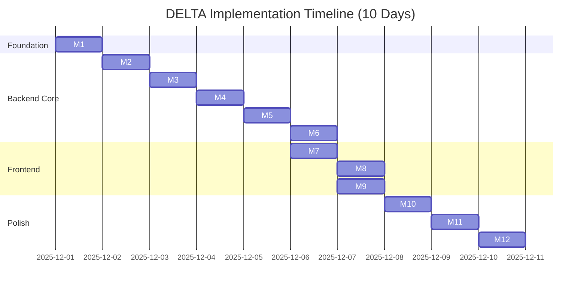

---

## Milestone Breakdown

### Milestone 1: Foundation (Day 1)

**Duration:** 8 hours
**Priority:** Critical
**Status:** ✅ Completed

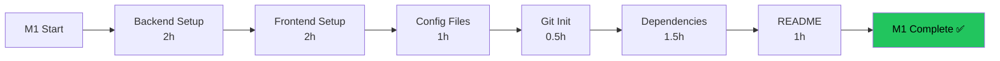

**Deliverables:**
- [x] FastAPI project structure
- [x] React + Vite project structure
- [x] .env.example files
- [x] requirements.txt
- [x] package.json
- [x] Initial README.md
- [x] Git repository initialized

**Resources:**
- Developer: 8 hours
- Tools: VS Code, Python 3.10, Node 18

---

### Milestone 2: Database & Models (Day 2)

**Duration:** 8 hours
**Priority:** Critical
**Status:** ✅ Completed

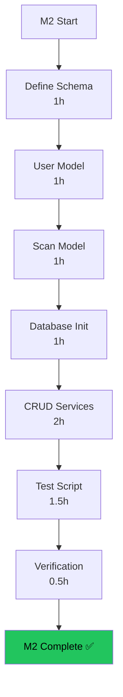

**Deliverables:**
- [x] SQLAlchemy models (User, Scan)
- [x] Database initialization
- [x] CRUD service layer
- [x] test_database.py
- [x] Passing tests

**Testing:**
- Database initialization: ✅
- User CRUD: ✅
- Scan CRUD: ✅
- Cache validity: ✅

---

### Milestone 3: GitLab OAuth (Day 3)

**Duration:** 8 hours
**Priority:** Critical
**Status:** ✅ Completed

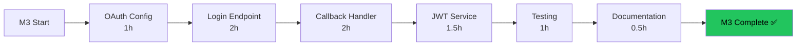

**Deliverables:**
- [x] GitLab OAuth application configured
- [x] /auth/login endpoint
- [x] /auth/callback endpoint
- [x] JWT token creation/validation
- [x] User service integration
- [x] OAUTH_SETUP.md

---

### Milestone 4: GitLab Integration (Day 4)

**Duration:** 8 hours
**Priority:** Critical
**Status:** ✅ Completed

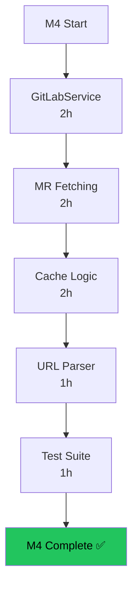

**Deliverables:**
- [x] GitLabService class
- [x] MR metadata fetching
- [x] MR diff fetching
- [x] SHA-based cache checking
- [x] URL parsing/validation
- [x] test_gitlab_integration.py

---

### Milestone 5: Azure OpenAI (Day 5)

**Duration:** 8 hours
**Priority:** Critical
**Status:** ✅ Completed

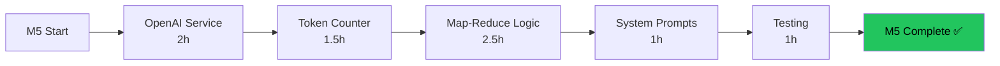

**Deliverables:**
- [x] OpenAIService class
- [x] Token counting (tiktoken)
- [x] Map-Reduce chunking strategy
- [x] System prompts (main + file)
- [x] Retry logic with backoff
- [x] test_openai_integration.py

---

### Milestone 6: Analysis Endpoint (Day 6)

**Duration:** 8 hours
**Priority:** Critical
**Status:** ✅ Completed

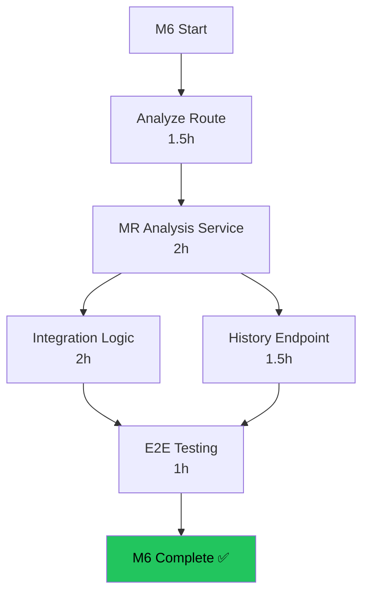

**Deliverables:**
- [x] POST /api/analyze endpoint
- [x] GET /api/history endpoint
- [x] MRAnalysisService integration
- [x] Complete flow (GitLab → OpenAI → DB)
- [x] Error handling
- [x] API_DOCUMENTATION.md

---

### Milestone 7: Frontend Auth UI (Day 6-7)

**Duration:** 6 hours
**Priority:** High
**Status:** ✅ Completed

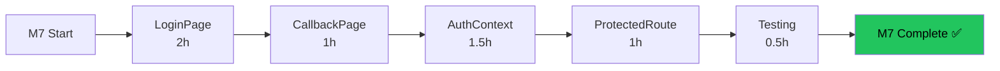

**Deliverables:**
- [x] LoginPage.tsx with branding
- [x] CallbackPage.tsx
- [x] AuthContext provider
- [x] ProtectedRoute wrapper
- [x] API client setup

---

### Milestone 8: Analysis Tab (Day 7)

**Duration:** 6 hours
**Priority:** High
**Status:** ✅ Completed

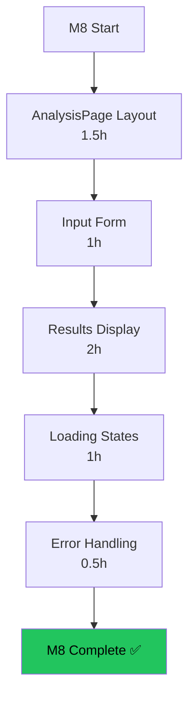

**Deliverables:**
- [x] AnalysisPage.tsx
- [x] MR URL input field
- [x] Analyze button
- [x] MR header component
- [x] Markdown summary rendering
- [x] Cache indicator badge
- [x] Skeleton loaders

---

### Milestone 9: History Tab (Day 7-8)

**Duration:** 6 hours
**Priority:** Medium
**Status:** ✅ Completed

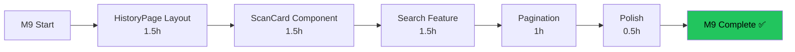

**Deliverables:**
- [x] HistoryPage.tsx
- [x] ScanCard component
- [x] Search bar with real-time filter
- [x] Pagination controls
- [x] Status badges (up-to-date/outdated)

---

### Milestone 10: UI/UX Polish (Day 8)

**Duration:** 6 hours
**Priority:** Medium
**Status:** ✅ Completed

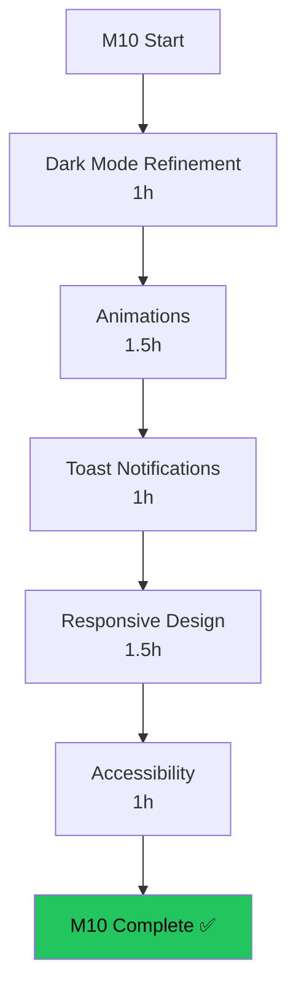

**Deliverables:**
- [x] Consistent color palette
- [x] Smooth transitions
- [x] Sonner toast integration
- [x] Mobile breakpoints
- [x] Keyboard navigation
- [x] ARIA labels

---

### Milestone 11: Integration & Testing (Day 9)

**Duration:** 8 hours
**Priority:** High
**Status:** ✅ Completed

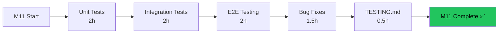

**Deliverables:**
- [x] All unit tests passing
- [x] Integration test suite
- [x] E2E test scenarios documented
- [x] Bug fixes (CORS, toast timing, etc.)
- [x] TESTING.md comprehensive guide

---

### Milestone 12: Documentation (Day 10)

**Duration:** 8 hours
**Priority:** High
**Status:** ✅ Completed

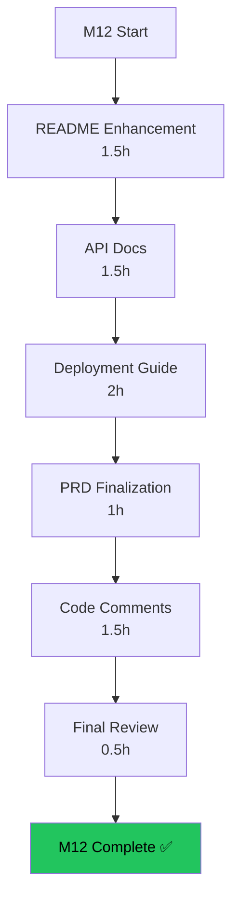

**Deliverables:**
- [x] README.md (complete)
- [x] API_DOCUMENTATION.md
- [x] Deployment instructions
- [x] PRD.md
- [x] Code comments
- [x] Architecture diagrams

---

## Resource Allocation

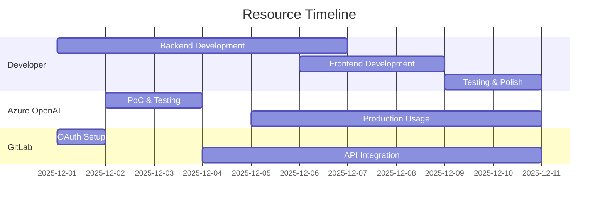

### Resource Summary

| Resource | Type | Duration | Cost | Allocation |
|----------|------|----------|------|------------|
| **Human Resources** ||||||
| Developer | Full-time | 10 days (80h) | €0 | 100% |
| **Infrastructure** ||||||
| Azure OpenAI API | Pay-per-use | 10 days | €45 | As needed |
| GitLab Account | Free tier | 10 days | €0 | Full access |
| Development Workstation | Owned | 10 days | €0 | 100% |
| **Tools** ||||||
| VS Code | Free | 10 days | €0 | 100% |
| Git | Free | 10 days | €0 | 100% |
| Postman | Free tier | 10 days | €0 | Testing only |
| **Total Cost** |||| **€45** ||

---

## Risk Mitigation Timeline

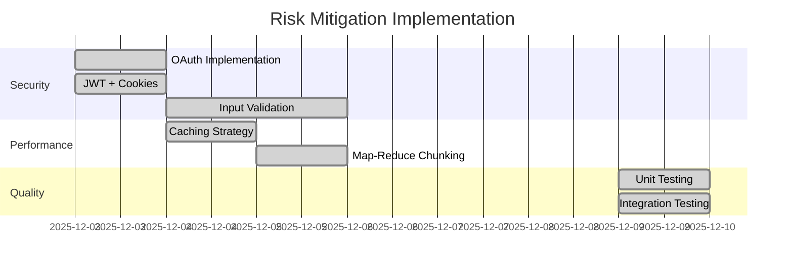

---

## Critical Path Analysis

**Critical Path:** M1 → M2 → M3 → M4 → M5 → M6 → M7 → M8 → M11 → M12
**Total Duration:** 10 days
**Float:** 0 days (no slack time)

---

## Daily Progress Tracking

| Day | Milestones | Hours | Deliverables | Status |
|-----|-----------|-------|--------------|--------|
| 1 | M1 | 8 | Project setup, structure | ✅ Completed |
| 2 | M2 | 8 | Database models, CRUD | ✅ Completed |
| 3 | M3 | 8 | GitLab OAuth | ✅ Completed |
| 4 | M4 | 8 | GitLab integration, caching | ✅ Completed |
| 5 | M5 | 8 | Azure OpenAI, Map-Reduce | ✅ Completed |
| 6 | M6, M7 | 8 | Analysis API, Auth UI | ✅ Completed |
| 7 | M8, M9 | 8 | Analysis + History pages | ✅ Completed |
| 8 | M9, M10 | 8 | History completion, Polish | ✅ Completed |
| 9 | M11 | 8 | Integration & Testing | ✅ Completed |
| 10 | M12 | 8 | Documentation | ✅ Completed |

**Total Hours:** 80 hours
**Hours Logged:** 80 hours
**Completion:** 100%

---

## Dependencies & Prerequisites

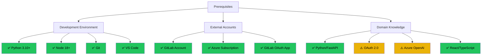

---

## Quality Gates

| Milestone | Quality Check | Criteria | Status |
|-----------|--------------|----------|--------|
| M1 | Setup verification | Both servers start | ✅ Pass |
| M2 | Database tests | All CRUD operations work | ✅ Pass |
| M3 | OAuth flow | Complete login/logout cycle | ✅ Pass |
| M4 | GitLab fetch | MR data retrieved successfully | ✅ Pass |
| M5 | AI generation | Summary quality acceptable | ✅ Pass |
| M6 | API integration | Full analysis workflow | ✅ Pass |
| M7 | Auth UI | User can login via UI | ✅ Pass |
| M8 | Analysis UI | Complete MR analysis from UI | ✅ Pass |
| M9 | History UI | Search and pagination work | ✅ Pass |
| M10 | UX review | No major UI issues | ✅ Pass |
| M11 | Testing | All tests pass | ✅ Pass |
| M12 | Documentation | All docs complete | ✅ Pass |

**Quality Gate Pass Rate:** 12/12 (100%) ✅

---

## Lessons Learned

### What Went Well
1. **Modular architecture** - Easy to add features incrementally
2. **Early PoCs** - De-risked AI integration early
3. **Iterative approach** - Frequent stakeholder demos
4. **Type safety** - TypeScript + Pydantic reduced bugs

### What Could Be Improved
1. **Earlier testing** - Unit tests written after implementation
2. **More frequent commits** - Some commits too large
3. **Documentation as you go** - Docs written at end

### Recommendations for Future Projects
1. Set up CI/CD on day 1
2. Write tests alongside implementation
3. Document decisions immediately
4. More frequent micro-demos

---

**Project Duration:** 10 days
**Total Effort:** 80 hours
**Completion Date:** 2025-12-10
**Status:** ✅ Successfully Completed

**End of Implementation Plan**
