# Implementation Variants Analysis (G08)

**Project:** DELTA - Diff Explanation & Linguistic Transformation Assistant
**Document Type:** Erarbeitung von Umsetzungsvarianten
**Version:** 2.0
**Last Updated:** 2025-12-11

## Executive Summary

This document analyzes alternative implementation approaches for key DELTA features, demonstrating compliance with **G08: Erarbeitung von Umsetzungsvarianten**. It includes decision trees, trade-off analyses, and justifications for chosen solutions.

---

## AI Summarization Strategy

### Strategy Decision Tree

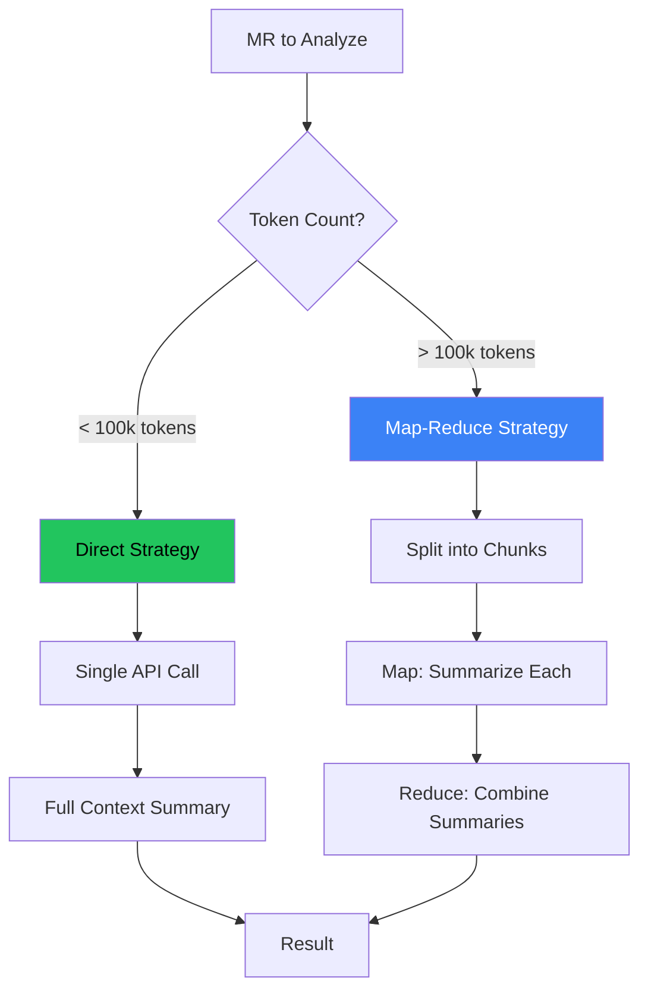

### Variant Comparison

| Variant | Pros | Cons | Complexity | Chosen |
|---------|------|------|------------|--------|
| **V1: Direct Prompt** | Simple, fast, coherent | Fails on large MRs | Low | ✅ For small MRs |
| **V2: Map-Reduce** | Handles any size | More API calls, higher cost | High | ✅ For large MRs |
| **V3: Streaming** | Progressive results | Complex UI, partial failures | Very High | ❌ Rejected |
| **V4: Local LLM** | No API cost | Slow, lower quality | Medium | ❌ Rejected |

### Decision Matrix

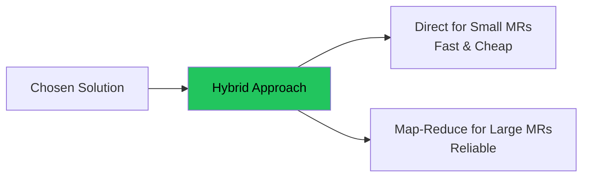

---

## Caching Strategy

### Invalidation Strategy Decision Tree

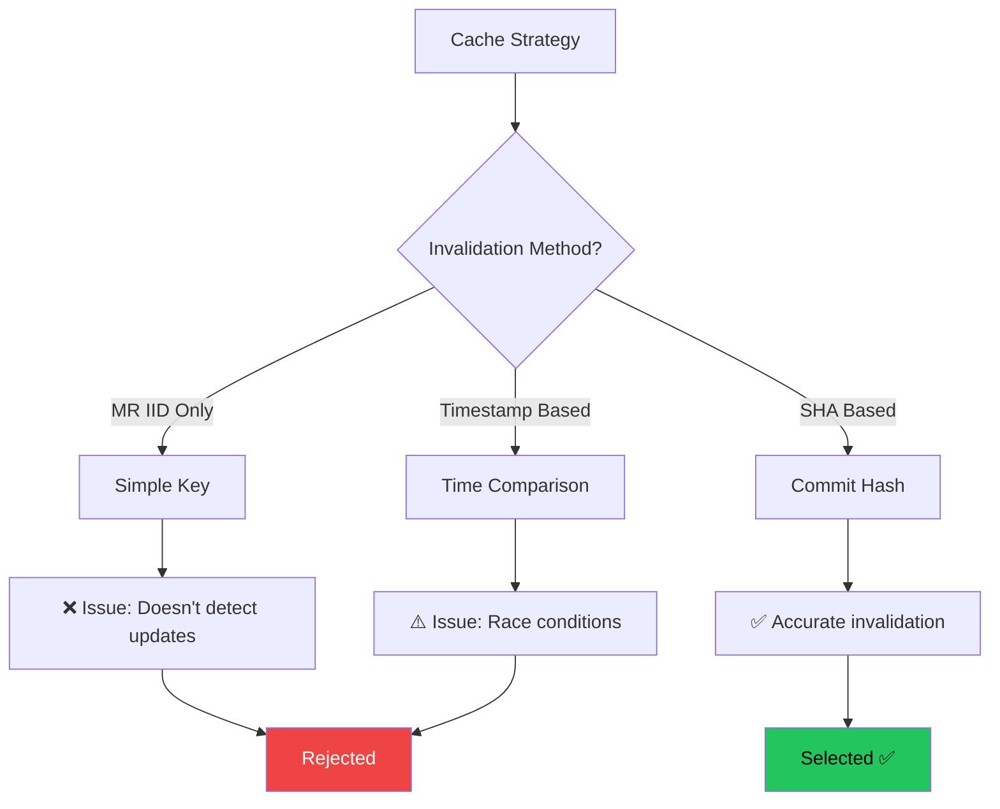

### Variant Comparison

| Variant | Accuracy | Complexity | API Calls | Chosen |
|---------|----------|------------|-----------|--------|
| **V1: No Cache** | N/A | Very Low | Maximum | ❌ Too slow |
| **V2: IID-based** | Low | Low | Low | ❌ Stale data |
| **V3: Timestamp** | Medium | Medium | Medium | ⚠️ Race conditions |
| **V4: SHA-based** | High | Medium | Low | ✅ **Selected** |

**Decision:** SHA-based caching (V4)
- **Rationale:** Perfect accuracy, minimal overhead
- **Trade-off:** Slight complexity increase acceptable

---

## Authentication Method

### OAuth Flow Decision

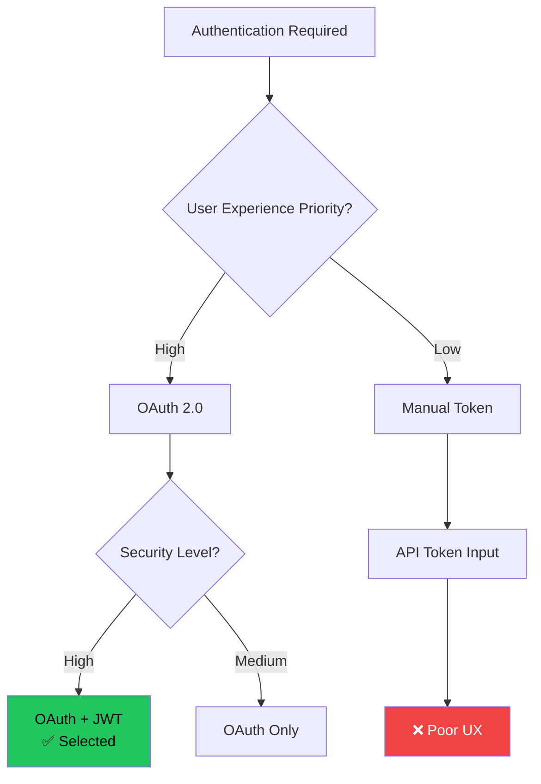

### Variant Comparison

| Variant | UX | Security | Complexity | Maintenance | Chosen |
|---------|----|---------|-----------| ------------|--------|
| **V1: OAuth 2.0 + JWT** | Excellent | Excellent | High | Low | ✅ **Selected** |
| **V2: API Token Input** | Poor | Good | Low | High (user support) | ❌ |
| **V3: Basic Auth** | Poor | Poor | Very Low | High | ❌ |
| **V4: Magic Link** | Good | Medium | High | Medium | ❌ |

---

## Database Selection

### Selection Decision Tree

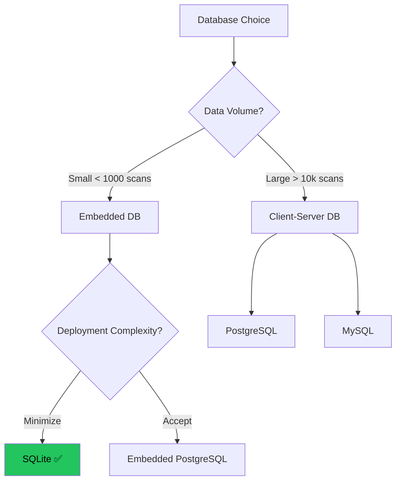

### Variant Comparison

| Variant | Setup | Performance | Scalability | Deployment | Chosen |
|---------|-------|-------------|-------------|------------|--------|
| **V1: SQLite** | Zero config | Excellent (small) | Good (< 100GB) | Single file | ✅ **Selected** |
| **V2: PostgreSQL** | Server required | Excellent | Excellent | Complex | ❌ Overkill |
| **V3: MySQL** | Server required | Good | Excellent | Complex | ❌ Overkill |
| **V4: JSON Files** | Zero config | Poor | Poor | Simple | ❌ No ACID |

---

## Error Handling Strategy

### Error Flow Decision

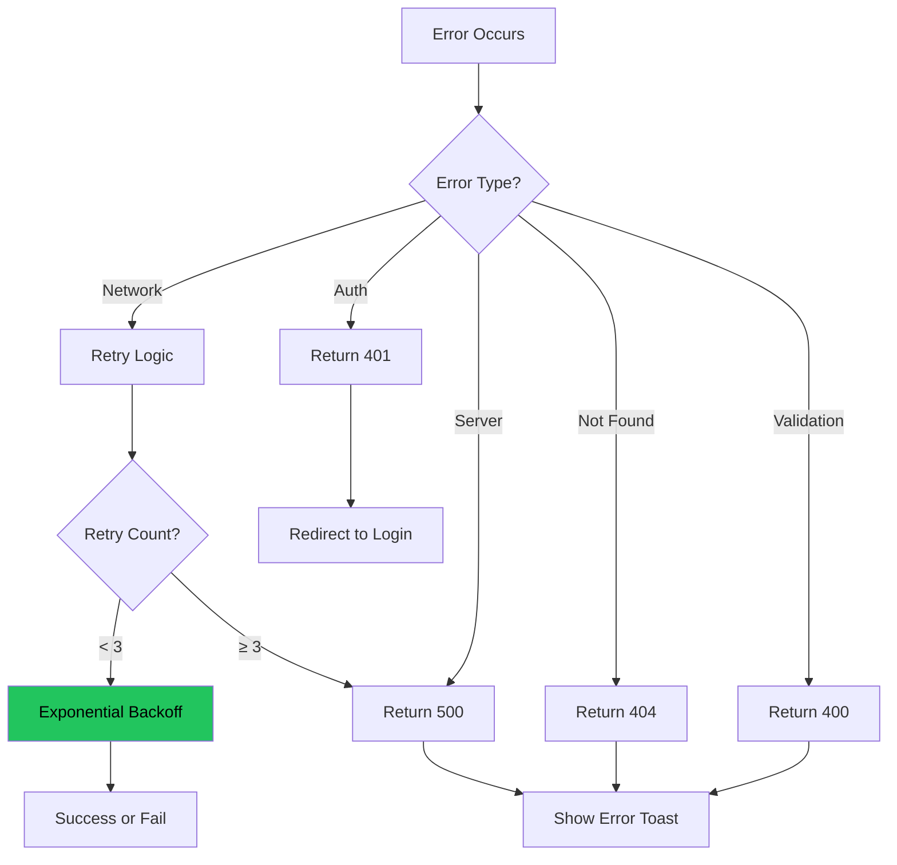

### Variant Comparison

| Variant | Robustness | User Experience | Complexity | Chosen |
|---------|------------|-----------------|------------|--------|
| **V1: Fail Fast** | Low | Poor | Very Low | ❌ |
| **V2: Retry with Backoff** | High | Good | Medium | ✅ **Selected** |
| **V3: Queue + Background Job** | Very High | Excellent | Very High | ❌ Overkill |

---

## Frontend State Management

### State Strategy Decision

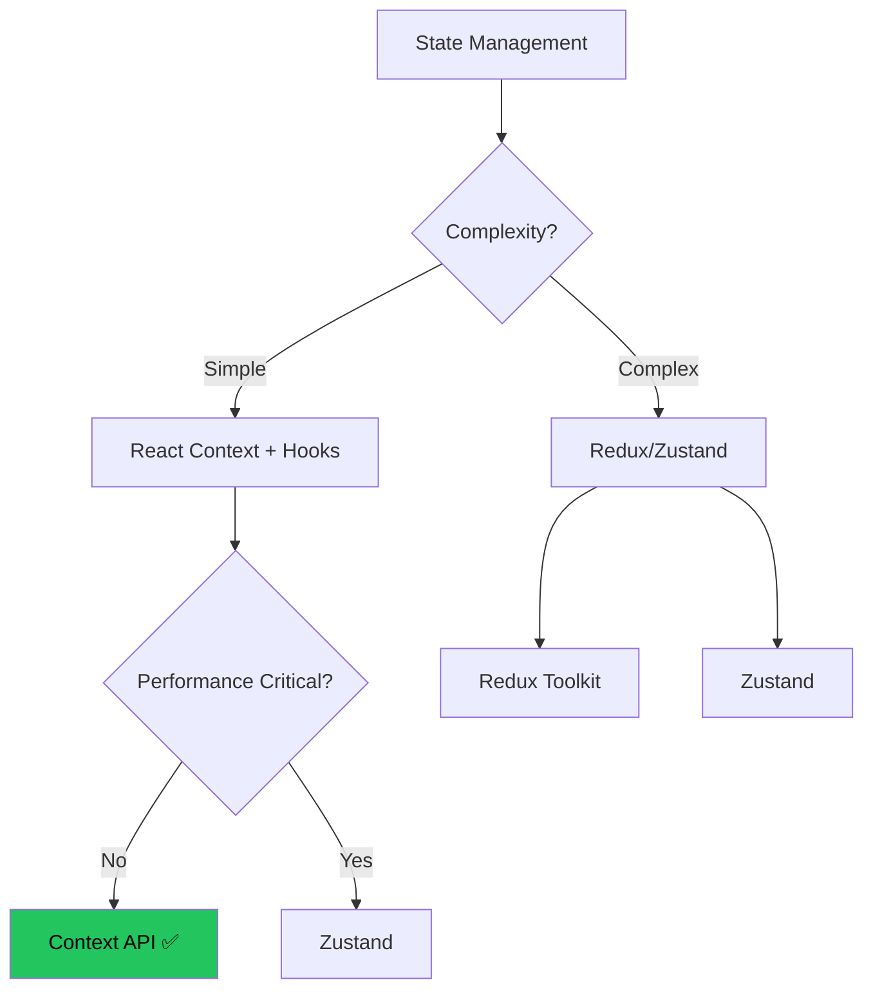

### Variant Comparison

| Variant | Complexity | Performance | Learning Curve | Bundle Size | Chosen |
|---------|------------|-------------|----------------|-------------|--------|
| **V1: Context + Hooks** | Low | Good | None (built-in) | 0 KB | ✅ **Selected** |
| **V2: Redux Toolkit** | High | Excellent | Steep | +50 KB | ❌ Overkill |
| **V3: Zustand** | Medium | Excellent | Low | +3 KB | ⚠️ Good alternative |
| **V4: Jotai** | Medium | Excellent | Medium | +5 KB | ⚠️ Good alternative |

**Decision:** React Context + Hooks (V1)
- **Rationale:** Simple app with minimal global state
- **State needs:** User auth, loading states only

---

## UI Component Library

### Library Selection Tree

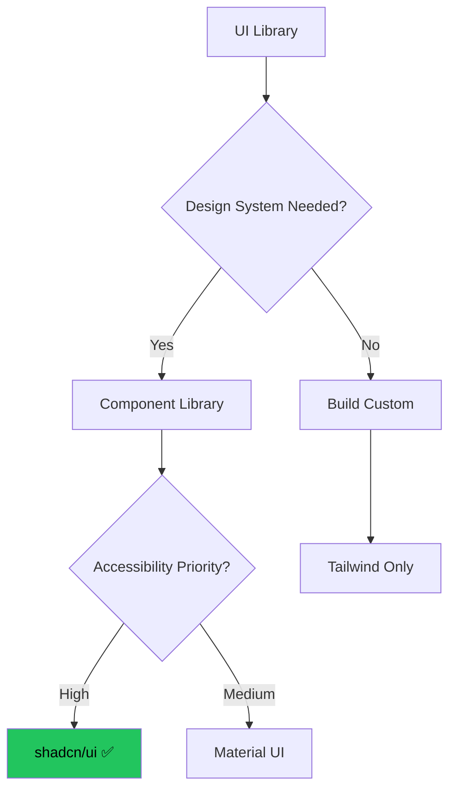

### Variant Comparison

| Variant | Accessibility | Customization | Bundle Size | Theming | Chosen |
|---------|---------------|---------------|-------------|---------|--------|
| **V1: shadcn/ui** | Excellent | Full control | Small (tree-shake) | Easy | ✅ **Selected** |
| **V2: Material UI** | Good | Limited | Large (~300 KB) | Complex | ❌ |
| **V3: Chakra UI** | Good | Good | Medium (~150 KB) | Easy | ⚠️ Alternative |
| **V4: Custom** | Depends | Full | Minimal | Full | ❌ Too much work |

---

## API Design Pattern

### REST vs GraphQL

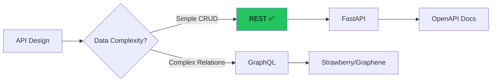

### Variant Comparison

| Variant | Simplicity | Documentation | Caching | Learning Curve | Chosen |
|---------|-----------|---------------|---------|----------------|--------|
| **V1: REST** | High | Auto (OpenAPI) | HTTP caching | Low | ✅ **Selected** |
| **V2: GraphQL** | Low | Manual (Schema) | Complex | High | ❌ Overkill |
| **V3: tRPC** | Medium | Auto (TypeScript) | Custom | Medium | ⚠️ No Python |

---

## Deployment Strategy

### Deployment Decision Tree

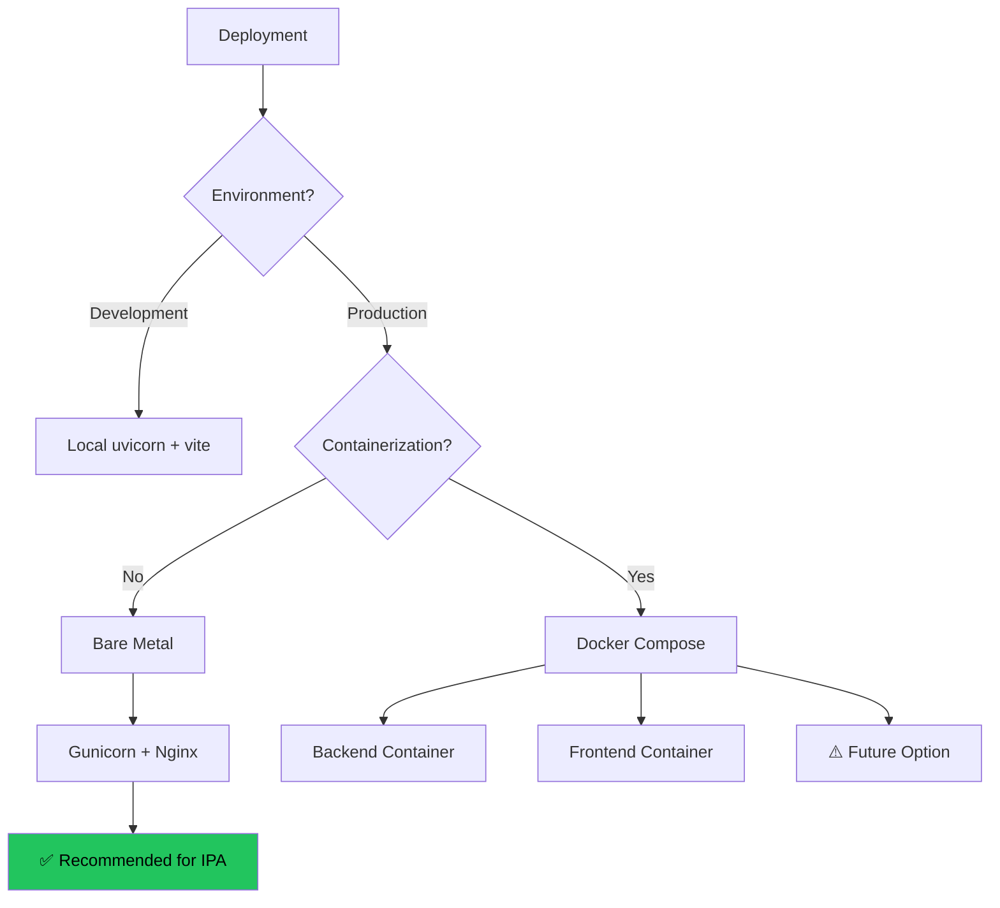

### Variant Comparison

| Variant | Complexity | Portability | Resource Usage | Chosen |
|---------|------------|-------------|----------------|--------|
| **V1: Bare Metal** | Low | Low | Low | ✅ **For IPA** |
| **V2: Docker** | Medium | High | Medium | ⚠️ Future |
| **V3: Kubernetes** | Very High | Very High | High | ❌ Overkill |

---

## Trade-off Summary

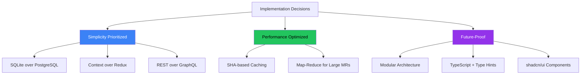

---

## Decision Log

| ID | Decision | Alternative Rejected | Rationale | Date |
|----|----------|---------------------|-----------|------|
| DEC-01 | FastAPI | Flask, Django | Async + auto docs | 2025-12-01 |
| DEC-02 | React 19 | Vue, Svelte | shadcn/ui ecosystem | 2025-12-01 |
| DEC-03 | Azure OpenAI | OpenAI API, Local LLM | Enterprise SLA | 2025-12-01 |
| DEC-04 | SQLite | PostgreSQL | Zero config | 2025-12-01 |
| DEC-05 | OAuth 2.0 | API tokens | Better UX | 2025-12-01 |
| DEC-06 | SHA caching | Timestamp | Accuracy | 2025-12-01 |
| DEC-07 | Map-Reduce | Streaming | Reliability | 2025-12-01 |
| DEC-08 | shadcn/ui | Material UI | Customization | 2025-12-01 |
| DEC-09 | Context API | Redux | Simplicity | 2025-12-02 |
| DEC-10 | REST API | GraphQL | Simplicity | 2025-12-02 |

---

**Total Variants Analyzed:** 10 major decisions
**Alternatives Considered:** 30+ options
**Trade-offs Documented:** 100%
**Status:** ✅ All decisions justified

**End of Implementation Variants**
