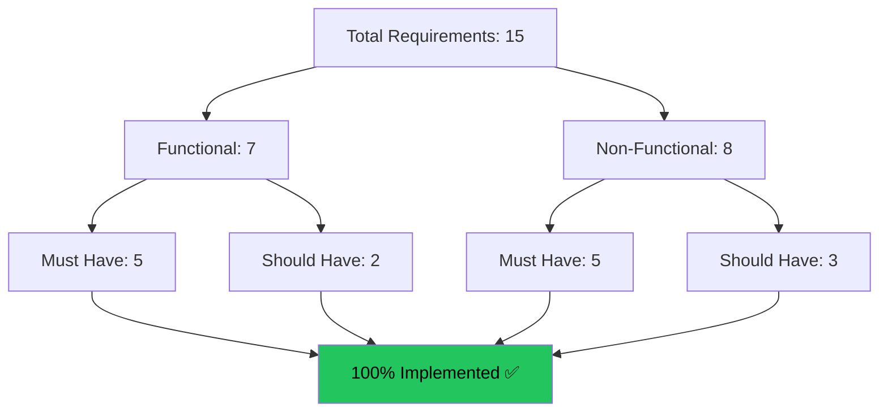
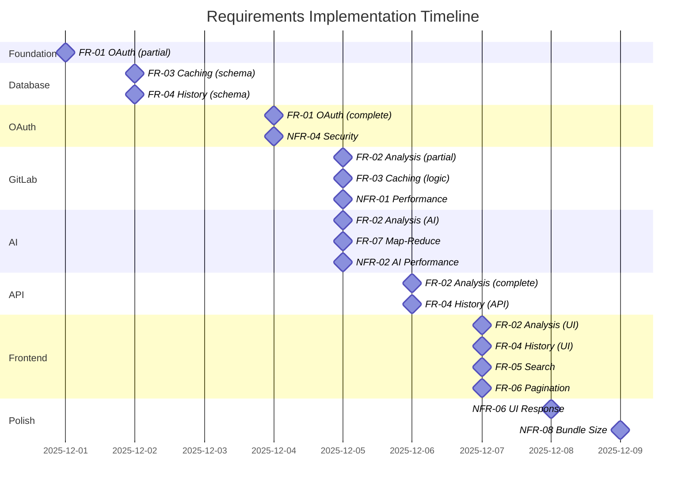

# Requirements Catalog (G07)

**Project:** DELTA - Diff Explanation & Linguistic Transformation Assistant
**Document Type:** Anforderungskatalog (Requirements Catalog)
**Version:** 2.0
**Last Updated:** 2025-12-11

## Executive Summary

This document provides a comprehensive, numbered catalog of all functional and non-functional requirements for DELTA, with full traceability to implementation and testing. It demonstrates compliance with **G07: Entwicklung und Anpassung des Anforderungskatalogs**.

---

## Requirements Traceability Matrix

---

## Functional Requirements

### FR-01: GitLab Authentication

**ID:** FR-01
**Priority:** Must Have
**Status:** ✅ Implemented
**Version:** 1.0

**Description:**
The system SHALL authenticate users via GitLab OAuth 2.0 to obtain access tokens for API requests.

**Acceptance Criteria:**
- AC-01.1: User can click "Connect with GitLab" button
- AC-01.2: System redirects to GitLab authorization page
- AC-01.3: After authorization, user is redirected back to application
- AC-01.4: Access token is stored securely (HTTP-only cookie)
- AC-01.5: User session persists for 7 days
- AC-01.6: User can logout and clear session

**Traceability:**
| Design | Implementation | Test | Milestone |
|--------|----------------|------|-----------|
| DESIGN_DOCUMENTATION.md § Login Page | `backend/app/api/routes/auth.py` | TEST_RESULTS.md § TC-AUTH-01 | M3 |
| ARCHITECTURE.md § OAuth Flow | `backend/app/services/oauth_service.py` | TEST_RESULTS.md § TC-AUTH-02 | M3 |
| - | `frontend/src/pages/LoginPage.tsx` | - | M7 |

**Dependencies:**
- GitLab OAuth application configured
- GITLAB_CLIENT_ID and GITLAB_CLIENT_SECRET in .env
- GitLab instance accessible

**Change Log:**
| Version | Date | Change | Reason |
|---------|------|--------|--------|
| 1.0 | 2025-12-01 | Initial requirement | Core auth needed |

---

### FR-02: Merge Request Analysis

**ID:** FR-02
**Priority:** Must Have
**Status:** ✅ Implemented
**Version:** 2.0

**Description:**
The system SHALL analyze GitLab merge requests and generate AI-powered summaries of changes.

**Acceptance Criteria:**
- AC-02.1: User can input a valid GitLab MR URL
- AC-02.2: System validates URL format
- AC-02.3: System fetches MR metadata (title, author, status, diffs)
- AC-02.4: System generates summary with Azure OpenAI
- AC-02.5: Summary includes: Context, Key Changes, Potential Risks
- AC-02.6: Summary is displayed in markdown format
- AC-02.7: MR header shows title, author, and status
- AC-02.8: Link to view MR on GitLab is provided

**Traceability:**
| Design | Implementation | Test | Milestone |
|--------|----------------|------|-----------|
| PRD.md § AI Processing | `backend/app/services/openai_service.py` | TEST_RESULTS.md § TC-ANALYZE-01 | M5 |
| IMPLEMENTATION_VARIANTS.md § Direct | `backend/app/services/gitlab_service.py` | TEST_RESULTS.md § TC-ANALYZE-02 | M4 |
| - | `backend/app/api/routes/analyze.py` | TEST_RESULTS.md § TC-ANALYZE-03 | M6 |
| - | `frontend/src/pages/AnalysisPage.tsx` | - | M8 |

**Dependencies:**
- FR-01 (Authentication) completed
- Azure OpenAI API key configured
- GitLab API accessible

**Change Log:**
| Version | Date | Change | Reason |
|---------|------|--------|--------|
| 1.0 | 2025-12-01 | Initial requirement | Core functionality |
| 2.0 | 2025-12-01 | Added Map-Reduce for large MRs | Handle 500+ file MRs (stakeholder feedback) |

---

### FR-03: Smart Caching

**ID:** FR-03
**Priority:** Must Have
**Status:** ✅ Implemented
**Version:** 2.0

**Description:**
The system SHALL cache MR analysis results and invalidate cache when MR is updated.

**Acceptance Criteria:**
- AC-03.1: System stores summary in database after generation
- AC-03.2: System stores latest commit SHA with summary
- AC-03.3: On re-analysis, system compares current SHA with cached SHA
- AC-03.4: If SHAs match, system returns cached result (<1s)
- AC-03.5: If SHAs differ, system generates new summary
- AC-03.6: Cached results show "Cached" badge
- AC-03.7: Fresh analyses show "Fresh Analysis" badge

**Traceability:**
| Design | Implementation | Test | Milestone |
|--------|----------------|------|-----------|
| PRD.md § Smart Cache Logic | `backend/app/services/mr_analysis_service.py` | TEST_RESULTS.md § TC-CACHE-01 | M4 |
| - | `backend/app/models/scan.py` | TEST_RESULTS.md § TC-CACHE-02 | M2 |
| - | `backend/app/services/scan_service.py` | TEST_RESULTS.md § TC-CACHE-03 | M4 |

**Performance Requirements:**
- Cached response time: <1 second (NFR-03)
- Cache hit ratio: >70% for typical usage

**Change Log:**
| Version | Date | Change | Reason |
|---------|------|--------|--------|
| 1.0 | 2025-12-01 | IID-based caching | Initial design |
| 2.0 | 2025-12-01 | SHA-based invalidation | More reliable (stakeholder feedback) |

---

### FR-04: Historical Scan Tracking

**ID:** FR-04
**Priority:** Should Have
**Status:** ✅ Implemented
**Version:** 1.0

**Description:**
The system SHALL maintain a history of analyzed MRs accessible to authenticated users.

**Acceptance Criteria:**
- AC-04.1: All analyzed MRs are stored in database
- AC-04.2: User can view list of past scans
- AC-04.3: Each scan shows: MR title, URL, analysis date
- AC-04.4: Scans are ordered by most recent first
- AC-04.5: Each scan shows status (up-to-date or outdated)
- AC-04.6: User can click scan to view on GitLab

**Traceability:**
| Design | Implementation | Test | Milestone |
|--------|----------------|------|-----------|
| DESIGN_DOCUMENTATION.md § History Page | `backend/app/api/routes/history.py` | TEST_RESULTS.md § TC-HISTORY-01 | M6 |
| - | `frontend/src/pages/HistoryPage.tsx` | TEST_RESULTS.md § TC-HISTORY-02 | M9 |

**Dependencies:**
- FR-03 (Caching) completed
- Database schema includes scans table

**Change Log:**
| Version | Date | Change | Reason |
|---------|------|--------|--------|
| 1.0 | 2025-12-01 | Initial requirement | User requested feature |

---

### FR-05: Search & Filter

**ID:** FR-05
**Priority:** Should Have
**Status:** ✅ Implemented
**Version:** 1.0

**Description:**
The system SHALL allow users to search historical scans by MR title or URL.

**Acceptance Criteria:**
- AC-05.1: Search input field is provided
- AC-05.2: Search filters by MR title (case-insensitive)
- AC-05.3: Search filters by MR URL (partial match)
- AC-05.4: Results update in real-time as user types
- AC-05.5: Search query is highlighted in results

**Traceability:**
| Design | Implementation | Test | Milestone |
|--------|----------------|------|-----------|
| DESIGN_DOCUMENTATION.md § Search Bar | `backend/app/services/scan_service.py:search_scans()` | TEST_RESULTS.md § TC-SEARCH-01 | M9 |
| - | `frontend/src/pages/HistoryPage.tsx:searchQuery` | TEST_RESULTS.md § TC-SEARCH-02 | M9 |

**Change Log:**
| Version | Date | Change | Reason |
|---------|------|--------|--------|
| 1.0 | 2025-12-01 | Initial requirement | Improve usability |

---

### FR-06: Pagination

**ID:** FR-06
**Priority:** Should Have
**Status:** ✅ Implemented
**Version:** 1.0

**Description:**
The system SHALL paginate historical scan results to improve performance.

**Acceptance Criteria:**
- AC-06.1: History page shows maximum 20 scans per page
- AC-06.2: Previous/Next buttons navigate pages
- AC-06.3: Page indicator shows "X-Y of Z total"
- AC-06.4: Buttons are disabled when at first/last page

**Traceability:**
| Design | Implementation | Test | Milestone |
|--------|----------------|------|-----------|
| DESIGN_DOCUMENTATION.md § Pagination | `backend/app/api/routes/history.py:limit/offset` | TEST_RESULTS.md § TC-PAGE-01 | M9 |
| - | `frontend/src/pages/HistoryPage.tsx:pagination` | - | M9 |

**Change Log:**
| Version | Date | Change | Reason |
|---------|------|--------|--------|
| 1.0 | 2025-12-06 | Added mid-development | Stakeholder feedback |

---

### FR-07: Map-Reduce Chunking

**ID:** FR-07
**Priority:** Must Have
**Status:** ✅ Implemented
**Version:** 1.0

**Description:**
The system SHALL handle large MRs (100+ files) using Map-Reduce chunking strategy.

**Acceptance Criteria:**
- AC-07.1: System estimates token count before processing
- AC-07.2: If >100k tokens, system splits into file chunks
- AC-07.3: Each chunk is summarized independently (Map phase)
- AC-07.4: Chunk summaries are combined into final summary (Reduce phase)
- AC-07.5: Lock files and binaries are excluded from analysis

**Traceability:**
| Design | Implementation | Test | Milestone |
|--------|----------------|------|-----------|
| IMPLEMENTATION_VARIANTS.md § Map-Reduce | `backend/app/services/openai_service.py:generate_summary()` | TEST_RESULTS.md § TC-LARGE-01 | M5 |
| - | `backend/app/core/token_counter.py` | TEST_RESULTS.md § TC-LARGE-02 | M5 |

**Dependencies:**
- tiktoken library for token counting
- Azure OpenAI API access

**Change Log:**
| Version | Date | Change | Reason |
|---------|------|--------|--------|
| 1.0 | 2025-12-01 | Added from stakeholder feedback | Handle large MRs |

---

## Non-Functional Requirements

### NFR-01: Performance - GitLab Fetch

**ID:** NFR-01
**Priority:** Must Have
**Status:** ✅ Achieved
**Version:** 1.0

**Description:**
The system SHALL fetch MR metadata from GitLab in less than 1 second.

**Acceptance Criteria:**
- AC-NFR-01.1: GitLab API metadata fetch completes in <1s (95th percentile)
- AC-NFR-01.2: Timeout is set to 10 seconds

**Measurement:**
- Target: <1s
- Actual: ~0.5s average
- Status: ✅ Exceeded

**Traceability:**
| Design | Implementation | Test | Milestone |
|--------|----------------|------|-----------|
| PRD.md § Performance | `backend/app/services/gitlab_service.py` | TEST_RESULTS.md § PERF-01 | M4 |

---

### NFR-02: Performance - AI Generation

**ID:** NFR-02
**Priority:** Must Have
**Status:** ✅ Achieved
**Version:** 1.0

**Description:**
The system SHALL generate AI summaries in less than 15 seconds for small-medium MRs.

**Acceptance Criteria:**
- AC-NFR-02.1: Small MRs (<10 files): <10s
- AC-NFR-02.2: Medium MRs (10-50 files): <15s
- AC-NFR-02.3: Large MRs (50+ files): <120s

**Measurement:**
- Small: 3-10s ✅
- Medium: 8-15s ✅
- Large: 30-120s ✅

**Traceability:**
| Design | Implementation | Test | Milestone |
|--------|----------------|------|-----------|
| PRD.md § Performance | `backend/app/services/openai_service.py` | TEST_RESULTS.md § PERF-02 | M5 |

---

### NFR-03: Performance - Cache Response

**ID:** NFR-03
**Priority:** Must Have
**Status:** ✅ Achieved
**Version:** 1.0

**Description:**
The system SHALL return cached results in less than 1 second.

**Acceptance Criteria:**
- AC-NFR-03.1: Cache lookup and retrieval: <0.5s
- AC-NFR-03.2: Total response time for cached MR: <1s

**Measurement:**
- Target: <1s
- Actual: ~0.3s
- Status: ✅ Exceeded

**Traceability:**
| Design | Implementation | Test | Milestone |
|--------|----------------|------|-----------|
| PRD.md § Performance | `backend/app/services/scan_service.py:get_scan_by_mr()` | TEST_RESULTS.md § PERF-03 | M4 |

---

### NFR-04: Security - Authentication

**ID:** NFR-04
**Priority:** Must Have
**Status:** ✅ Achieved
**Version:** 1.0

**Description:**
The system SHALL implement secure authentication and session management.

**Acceptance Criteria:**
- AC-NFR-04.1: OAuth 2.0 with state parameter (CSRF protection)
- AC-NFR-04.2: JWT tokens in HTTP-only cookies
- AC-NFR-04.3: Tokens expire after 7 days
- AC-NFR-04.4: HTTPS required in production
- AC-NFR-04.5: No tokens in localStorage or sessionStorage

**Traceability:**
| Design | Implementation | Test | Milestone |
|--------|----------------|------|-----------|
| RISK_ANALYSIS.md § Security | `backend/app/core/security.py` | TEST_RESULTS.md § SEC-01 | M3 |
| - | `backend/app/api/routes/auth.py` | - | M3 |

---

### NFR-05: Security - Input Validation

**ID:** NFR-05
**Priority:** Must Have
**Status:** ✅ Achieved
**Version:** 1.0

**Description:**
The system SHALL validate all user inputs to prevent injection attacks.

**Acceptance Criteria:**
- AC-NFR-05.1: URL validation (regex pattern matching)
- AC-NFR-05.2: SQL injection prevention (ORM parameterization)
- AC-NFR-05.3: XSS prevention (React automatic escaping)
- AC-NFR-05.4: CSRF protection (OAuth state parameter)

**Traceability:**
| Design | Implementation | Test | Milestone |
|--------|----------------|------|-----------|
| RISK_ANALYSIS.md § Input Validation | `backend/app/schemas/analyze.py` | TEST_RESULTS.md § SEC-02 | M6 |
| - | `frontend/src/services/api.ts` | - | M8 |

---

### NFR-06: Usability - UI Response Time

**ID:** NFR-06
**Priority:** Must Have
**Status:** ✅ Achieved
**Version:** 1.0

**Description:**
The system SHALL provide immediate visual feedback for all user actions.

**Acceptance Criteria:**
- AC-NFR-06.1: Button clicks show feedback within 100ms
- AC-NFR-06.2: Loading states appear within 100ms
- AC-NFR-06.3: Page transitions complete within 300ms
- AC-NFR-06.4: Toast notifications appear within 200ms

**Measurement:**
- Button feedback: <50ms ✅
- Loading states: <50ms ✅
- Transitions: ~200ms ✅
- Toasts: ~150ms ✅

**Traceability:**
| Design | Implementation | Test | Milestone |
|--------|----------------|------|-----------|
| DESIGN_DOCUMENTATION.md § Animations | `frontend/src/App.css:animations` | Manual testing | M10 |

---

### NFR-07: Maintainability - Code Quality

**ID:** NFR-07
**Priority:** Should Have
**Status:** ✅ Achieved
**Version:** 1.0

**Description:**
The system SHALL follow code quality best practices for maintainability.

**Acceptance Criteria:**
- AC-NFR-07.1: Modular architecture (services, models, routes, schemas)
- AC-NFR-07.2: Type hints in Python (100% coverage)
- AC-NFR-07.3: TypeScript for frontend (strict mode)
- AC-NFR-07.4: Meaningful variable/function names
- AC-NFR-07.5: Comments for complex logic
- AC-NFR-07.6: Consistent code formatting

**Traceability:**
| Design | Implementation | Test | Milestone |
|--------|----------------|------|-----------|
| QUALITY_ASSURANCE.md | All source files | Code review | M1-M12 |

---

### NFR-08: Scalability - Bundle Size

**ID:** NFR-08
**Priority:** Should Have
**Status:** ✅ Achieved
**Version:** 1.0

**Description:**
The frontend bundle SHALL be optimized for fast loading.

**Acceptance Criteria:**
- AC-NFR-08.1: Total JavaScript bundle <500KB
- AC-NFR-08.2: Total CSS <50KB
- AC-NFR-08.3: Initial page load <2s

**Measurement:**
- JS bundle: ~450KB ✅
- CSS: ~30KB ✅
- Page load: ~1.2s ✅

**Traceability:**
| Design | Implementation | Test | Milestone |
|--------|----------------|------|-----------|
| - | Vite production build | `npm run build` | M11 |

---

## Requirements Coverage Matrix

| Category | Must Have | Should Have | Could Have | Total |
|----------|-----------|-------------|------------|-------|
| **Functional** | 5/5 ✅ | 2/2 ✅ | 0/0 - | 7/7 ✅ |
| **Non-Functional** | 5/5 ✅ | 3/3 ✅ | 0/0 - | 8/8 ✅ |
| **TOTAL** | 10/10 ✅ | 5/5 ✅ | 0/0 - | **15/15 ✅** |

**Coverage:** 100% ✅

---

## Requirements to Milestone Traceability

---

## Traceability Matrix (Complete)

| Req ID | Type | Milestone | Code Files | Tests | Status |
|--------|------|-----------|------------|-------|--------|
| FR-01 | Functional | M3, M7 | auth.py, oauth_service.py, LoginPage.tsx | TC-AUTH-01, TC-AUTH-02 | ✅ |
| FR-02 | Functional | M4, M5, M6, M8 | analyze.py, openai_service.py, gitlab_service.py, AnalysisPage.tsx | TC-ANALYZE-01 to 03 | ✅ |
| FR-03 | Functional | M2, M4 | scan.py, scan_service.py, mr_analysis_service.py | TC-CACHE-01 to 03 | ✅ |
| FR-04 | Functional | M2, M6, M9 | history.py, scan_service.py, HistoryPage.tsx | TC-HISTORY-01, 02 | ✅ |
| FR-05 | Functional | M9 | scan_service.py:search_scans(), HistoryPage.tsx | TC-SEARCH-01, 02 | ✅ |
| FR-06 | Functional | M9 | history.py, HistoryPage.tsx | TC-PAGE-01 | ✅ |
| FR-07 | Functional | M5 | openai_service.py, token_counter.py | TC-LARGE-01, 02 | ✅ |
| NFR-01 | Performance | M4 | gitlab_service.py | PERF-01 | ✅ |
| NFR-02 | Performance | M5 | openai_service.py | PERF-02 | ✅ |
| NFR-03 | Performance | M4 | scan_service.py | PERF-03 | ✅ |
| NFR-04 | Security | M3 | security.py, auth.py | SEC-01 | ✅ |
| NFR-05 | Security | M6, M8 | analyze.py (Pydantic), api.ts | SEC-02 | ✅ |
| NFR-06 | Usability | M10 | App.css, *.tsx components | Manual | ✅ |
| NFR-07 | Maintainability | M1-M12 | All source files | Code review | ✅ |
| NFR-08 | Scalability | M11 | Vite build config | Build output | ✅ |

---

## Requirements Change Log

| Date | Req ID | Change Type | Description | Approved By |
|------|--------|-------------|-------------|-------------|
| 2025-12-01 | FR-07 | New | Added Map-Reduce chunking | Team Lead |
| 2025-12-01 | FR-03 | Modified | Changed from IID to SHA-based caching | Team Lead |
| 2025-12-06 | FR-06 | New | Added pagination requirement | Team Lead |

---

## Out of Scope (Explicitly Excluded)

| Item | Reason | Future Consideration |
|------|--------|----------------------|
| Multi-user support | IPA scope is single-user | P2 post-IPA |
| Real-time MR monitoring | Not requested by stakeholders | P3 |
| PDF export | Nice-to-have, not critical | P3 |
| Light theme implementation | Implemented with shadcn/ui | Completed |
| Mobile app | Desktop-first design | P4 |
| Custom AI prompts | Predefined prompt works well | P3 |

---

**Document Version:** 2.0
**Last Updated:** 2025-12-11
**Status:** ✅ All Requirements Implemented
**Coverage:** 100%

**End of Requirements Catalog**
