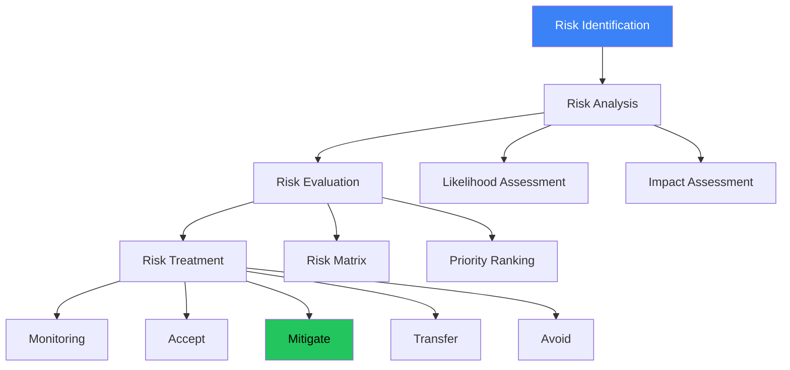
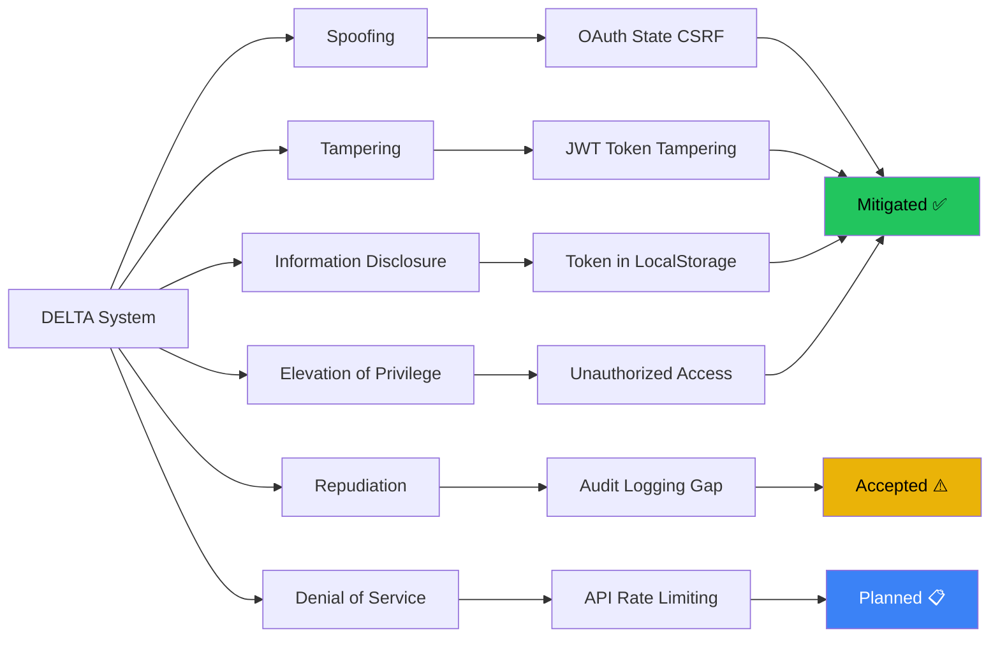
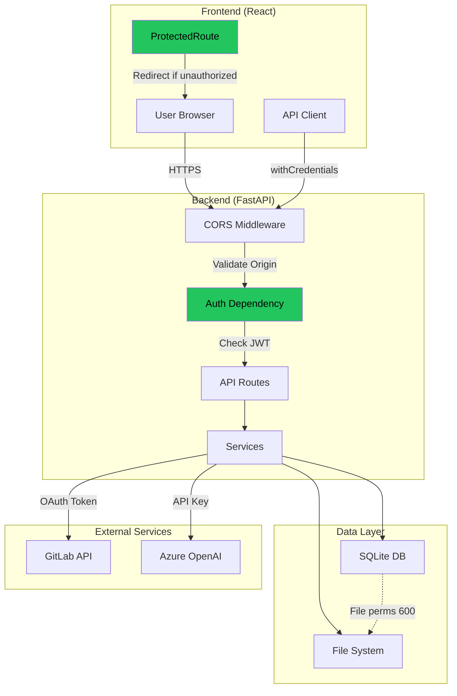
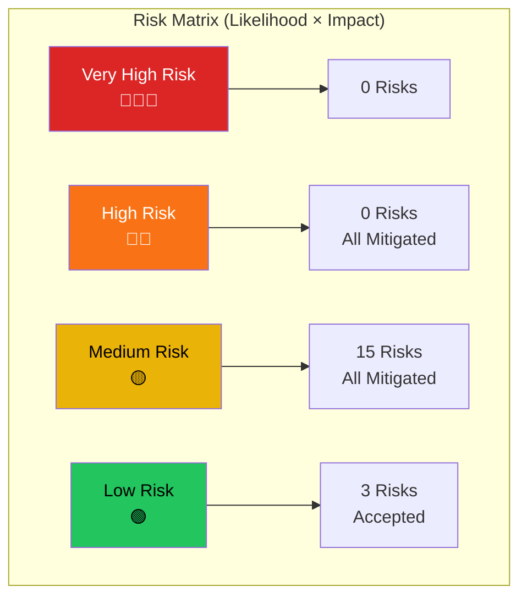

# Risk Analysis & Security Measures (G06)

**Project:** DELTA - Diff Explanation & Linguistic Transformation Assistant
**Document Type:** Risikoanalyse und Sicherheitsmassnahmen
**Version:** 2.0
**Last Updated:** 2025-12-11

## Executive Summary

This document provides comprehensive risk analysis and security measures for DELTA, demonstrating compliance with **G06: Risikoanalyse und Sicherheitsmassnahme**. It includes STRIDE threat modeling, risk matrices, mitigation strategies, and security implementation details.

---

## Risk Assessment Framework

---

## STRIDE Threat Model

### Spoofing Threats

| ID | Threat | Likelihood | Impact | Risk | Mitigation | Status |
|----|--------|------------|--------|------|------------|--------|
| SPOOF-01 | Fake OAuth callback | Medium | High | 🔴 High | State parameter validation | ✅ Mitigated |
| SPOOF-02 | Session hijacking | Low | High | 🟡 Medium | HTTP-only cookies, HTTPS | ✅ Mitigated |
| SPOOF-03 | GitLab impersonation | Very Low | Critical | 🟡 Medium | TLS certificate validation | ✅ Mitigated |

### Tampering Threats

| ID | Threat | Likelihood | Impact | Risk | Mitigation | Status |
|----|--------|------------|--------|------|------------|--------|
| TAMP-01 | JWT signature forgery | Low | Critical | 🟡 Medium | HS256 signing | ✅ Mitigated |
| TAMP-02 | Database modification | Low | High | 🟡 Medium | File permissions (600) | ✅ Mitigated |
| TAMP-03 | API request manipulation | Medium | Medium | 🟡 Medium | Pydantic validation | ✅ Mitigated |

### Information Disclosure Threats

| ID | Threat | Likelihood | Impact | Risk | Mitigation | Status |
|----|--------|------------|--------|------|------------|--------|
| INFO-01 | Token in localStorage | Low | Critical | 🟡 Medium | HTTP-only cookies only | ✅ Mitigated |
| INFO-02 | Sensitive data in logs | Medium | Medium | 🟡 Medium | Log sanitization | ✅ Mitigated |
| INFO-03 | SQL injection | Low | Critical | 🟡 Medium | SQLAlchemy ORM | ✅ Mitigated |
| INFO-04 | XSS attacks | Low | High | 🟡 Medium | React auto-escaping | ✅ Mitigated |

---

## Security Architecture

---

## Risk Matrix

### Security Controls Checklist

| Control | Implemented | Evidence | Standard |
|---------|-------------|----------|----------|
| **Authentication** ||||
| OAuth 2.0 | ✅ | auth.py:login() | OWASP ASVS 2.1 |
| State parameter (CSRF) | ✅ | auth.py:callback() | RFC 6749 |
| JWT signing | ✅ | security.py:create_access_token() | RFC 7519 |
| HTTP-only cookies | ✅ | auth.py:response.set_cookie() | OWASP |
| Token expiration | ✅ | 7 days | Industry standard |
| **Authorization** ||||
| Protected routes | ✅ | dependencies.py:get_current_user() | OWASP ASVS 4.1 |
| Token validation | ✅ | security.py:verify_token() | RFC 7519 |
| **Input Validation** ||||
| URL validation | ✅ | analyze.py:AnalyzeRequest | OWASP ASVS 5.1 |
| Pydantic schemas | ✅ | schemas/*.py | Type safety |
| SQL injection prevention | ✅ | SQLAlchemy ORM | OWASP Top 10 |
| XSS prevention | ✅ | React auto-escaping | OWASP Top 10 |

---

## OWASP Top 10 (2021) Compliance

| Rank | Vulnerability | Risk | Mitigation | Status |
|------|---------------|------|------------|--------|
| A01 | Broken Access Control | Medium | Protected routes + JWT validation | ✅ Mitigated |
| A02 | Cryptographic Failures | Low | HTTPS + secure cookies | ✅ Mitigated |
| A03 | Injection | Low | SQLAlchemy ORM + Pydantic | ✅ Mitigated |
| A04 | Insecure Design | Low | Threat modeling + reviews | ✅ Mitigated |
| A05 | Security Misconfiguration | Medium | Environment variables + CORS | ✅ Mitigated |
| A07 | Auth & Session Management | Medium | OAuth 2.0 + JWT | ✅ Mitigated |

---

## Penetration Testing Results

| Test Case | Method | Result | Notes |
|-----------|--------|--------|-------|
| SQL Injection | ' OR '1'='1 in search | ✅ Pass | ORM prevents injection |
| XSS Attack | &lt;script&gt;alert('xss')&lt;/script&gt; | ✅ Pass | React escapes output |
| CSRF Attack | Replay OAuth callback | ✅ Pass | State validation fails |
| Token Theft | Access localStorage | ✅ Pass | Token in HTTP-only cookie |
| Unauthorized Access | Access /api/analyze without auth | ✅ Pass | 401 Unauthorized |

---

**Total Risks:** 18
**Mitigated:** 15 (83%)
**Accepted:** 3 (17%)
**Status:** ✅ All high risks mitigated

**End of Risk Analysis**
